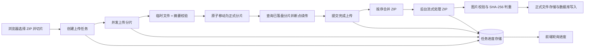

# 大文件 ZIP 上传功能实现方案与交接说明

> 本文用于在无法共享源码仓库的情况下，完整交接当前项目的文件上传实现思路、接口契约、状态语义、存储规则和关键边界。
>
> 文档只介绍上传主链路，以及上传完成后与图片 ZIP 直接相关的处理。不包含历史图片回填、服务器目录导入、维护脚本、Docker/Compose、Nginx 部署或其他业务功能。

## 1. 功能目标与适用范围

当前功能面向超大图片 ZIP 包上传，设计目标是：

- 支持 GB、TB 级文件，避免一个 HTTP 请求承载整个压缩包。
- 支持分片并发上传、失败重试和页面刷新后的断点续传。
- 在分片落盘前校验内容摘要，避免损坏数据覆盖有效分片。
- 所有分片到齐后按序合并，保证还原出的 ZIP 字节顺序正确。
- 将耗时的 ZIP 解压、图片校验、内容判重和入库放到后台执行。
- 使用统一任务状态和进度接口，供前端展示上传阶段与后台处理阶段。
- 通过流式读写控制 JVM 内存占用，不把整个 ZIP 或整张图片一次性加载到内存。

从职责上看，整个功能分为两层：

1. **通用上传层**：创建任务、接收分片、分片校验、断点续传、取消、合并和进度管理。
2. **图片 ZIP 业务处理层**：流式读取 ZIP 条目、图片安全校验、SHA-256 判重、正式文件存储和数据库写入。

如果公司项目只需要上传普通文件，可以完整复用第一层，并把第二层替换成自己的文件处理器。

## 2. 当前技术方案概览

当前样例使用以下技术：

- Java 17
- Spring Boot 3.3
- Spring MVC multipart 接口
- Spring Validation
- Spring `@Async` + 独立线程池
- Redis 或 JVM 内存保存任务进度
- 本地文件系统保存分片、合并文件和正式图片
- Apache Commons Compress 流式读取 ZIP
- MyBatis + MySQL 5.7 保存图片记录
- SHA-256 作为图片内容判重依据

整体数据流如下：



## 3. 模块职责划分

建议在公司项目中仍然保持以下职责边界，不要把所有逻辑堆在 Controller 中。

| 模块 | 主要职责 | 不应承担的职责 |
| --- | --- | --- |
| 上传接口层 | 参数绑定、请求校验、HTTP 状态和响应 DTO | 文件系统细节、ZIP 解压、数据库判重 |
| 上传编排服务 | 驱动任务状态、调用分片存储、触发合并和后台处理 | 直接解析 ZIP 条目 |
| 分片存储服务 | 临时写入、摘要校验、正式分片落盘、分片列表、合并和清理 | 业务数据入库 |
| 任务进度存储 | 保存、查询和删除任务快照 | 保存大文件内容 |
| 后台文件处理器 | 处理合并后的文件，并持续更新业务处理进度 | 接收 multipart 请求 |
| 图片 ZIP 处理器 | ZIP 条目校验、图片类型识别、内容哈希、去重和入库 | 管理前端分片 |
| 图片仓储适配器 | 查询内容哈希、插入新记录、更新重复记录 | 决定上传状态 |

这一拆分的关键收益是：上传传输协议不依赖图片业务。后续即使改成上传视频、Excel 或其他归档文件，也只需要替换“后台文件处理器”。

## 4. 完整上传时序

### 4.1 前端准备文件

前端选择 ZIP 后：

1. 校验文件扩展名和基本大小。
2. 按固定大小切分 `Blob`，分片序号从 `0` 开始。
3. 计算：

```text
totalChunks = ceil(fileSize / chunkSize)
chunkStart  = chunkIndex * chunkSize
chunkEnd    = min(chunkStart + chunkSize, fileSize)
```

当前前端方案建议：

- 分片大小：`64MB`
- 同时上传分片数：`3`
- 后台进度轮询间隔：`2s`
- 分片摘要算法：`SHA-256`

后端单个 multipart 请求上限为 `128MB`，所以分片必须明显小于该值，并为 multipart 边界和网关限制留出余量。

### 4.2 创建上传任务

前端先提交文件元数据，后端生成 UUID 形式的 `uploadId`，保存初始任务快照并返回给前端。

`uploadId` 是后续所有分片、完成、查询和取消请求的关联键。

### 4.3 上传分片

前端可以按有限并发上传不同序号的分片。服务端对每个分片执行：

1. 检查上传任务是否存在。
2. 校验分片序号。
3. 创建 `chunks/{uploadId}` 目录。
4. 把请求流写入临时文件，同时增量计算摘要。
5. 比较客户端摘要和服务端摘要。
6. 校验成功后，将临时文件原子移动为正式分片文件。
7. 扫描磁盘上的正式分片，重新计算已上传分片数。
8. 将状态更新为 `UPLOADING`。

正式分片只有在完整写入并通过摘要校验后才可见，因此断点续传不会把半个文件误认为成功分片。

### 4.4 断点续传

页面刷新或网络中断后，前端使用保存的 `uploadId` 查询服务端已落盘分片列表，只补传缺失序号。

服务端以磁盘上的正式分片文件为事实来源，而不是简单相信一个累计计数。这样同一分片重试多次也只计为一个已上传分片。

### 4.5 完成上传

所有分片上传成功后，前端调用完成接口。当前后端会：

1. 把任务状态改为 `MERGING`。
2. 从 `0` 到 `totalChunks - 1` 逐个检查分片是否存在。
3. 使用固定大小缓冲区，按序把每个分片追加到合并文件。
4. 合并成功后删除整个分片目录。
5. 把任务状态改为 `PROCESSING`。
6. 向独立线程池提交图片 ZIP 后台处理任务。

合并后的文件名不使用用户原始文件名，而是固定保存为 `{uploadId}.zip`，从而避免文件名冲突和路径注入。

### 4.6 后台处理与进度查询

后台线程流式扫描合并后的 ZIP。前端轮询统一进度接口，直到状态进入：

- `DONE`：整个 ZIP 已扫描完毕。允许其中存在被过滤的条目，具体看 `failed` 数量。
- `FAILED`：发生导致整个任务无法继续的致命错误，具体看 `message`。

## 5. HTTP 接口契约

基础路径：

```text
/api/picture-zip/uploads
```

### 5.1 接口总览

| 操作 | 方法与路径 | 当前成功状态 | 用途 |
| --- | --- | --- | --- |
| 创建任务 | `POST /api/picture-zip/uploads` | `200 OK` | 创建 `uploadId` 和初始进度 |
| 上传分片 | `PUT /api/picture-zip/uploads/{uploadId}/chunks/{chunkIndex}` | `200 OK` | 上传或重试一个分片 |
| 查询分片 | `GET /api/picture-zip/uploads/{uploadId}/chunks` | `200 OK` | 获取真实已落盘序号，用于续传 |
| 完成上传 | `POST /api/picture-zip/uploads/{uploadId}/complete` | `200 OK` | 合并分片并触发后台处理 |
| 查询进度 | `GET /api/picture-zip/uploads/{uploadId}` | `200 OK` | 查询上传和后台处理进度 |
| 取消任务 | `DELETE /api/picture-zip/uploads/{uploadId}` | `204 No Content` | 清理未完成任务的分片和进度 |

### 5.2 创建上传任务

请求：

```http
POST /api/picture-zip/uploads
Content-Type: application/json
```

```json
{
  "originalFilename": "dataset.zip",
  "totalChunks": 1024,
  "totalSize": 1099511627776,
  "businessArea": "medical",
  "operator": "alice"
}
```

字段说明：

| 字段 | 当前校验 | 含义 |
| --- | --- | --- |
| `originalFilename` | 非空 | 用户选择的原始 ZIP 文件名，用于展示和追溯 |
| `totalChunks` | 大于等于 `1` | 前端切分出的分片总数 |
| `totalSize` | 大于 `0` | 原文件总字节数 |
| `businessArea` | 非空、最长 `50`、必须命中后端白名单 | 决定图片写入哪个业务域 |
| `operator` | 非空、最长 `50` | 上传责任人和导入审计信息 |

响应：

```json
{
  "uploadId": "0bfca031-8cf7-428f-89a8-7d93dba6b35d",
  "status": "CREATED"
}
```

当前实现会保存 `originalFilename`、`totalChunks`、`businessArea` 和 `operator`。`totalSize` 目前只做请求校验，没有保存到任务进度，也没有在合并后核对实际字节数；公司实现应补齐这一点。

### 5.3 上传单个分片

请求：

```http
PUT /api/picture-zip/uploads/{uploadId}/chunks/{chunkIndex}
Content-Type: multipart/form-data
```

表单字段：

```text
file=@chunk.bin
checksumAlgorithm=SHA-256
checksum=<当前分片的十六进制摘要>
```

规则：

- `chunkIndex` 从 `0` 开始。
- 当前支持 `MD5` 和 `SHA-256`，校验值大小写不敏感。
- `checksumAlgorithm` 和 `checksum` 可以同时不传，以兼容旧客户端。
- 只要传其中一个，就必须两个都传。
- MD5 摘要必须是 `32` 位十六进制字符串。
- SHA-256 摘要必须是 `64` 位十六进制字符串。
- 校验失败返回 `400`，删除本次临时文件，不覆盖同序号的旧有效分片。
- 重传同一序号且校验成功时，当前正式分片会被新分片替换，但已上传数量仍只增加一次。

成功响应使用统一进度结构，例如：

```json
{
  "uploadId": "0bfca031-8cf7-428f-89a8-7d93dba6b35d",
  "originalFilename": "dataset.zip",
  "status": "UPLOADING",
  "totalChunks": 1024,
  "uploadedChunks": 17,
  "totalFiles": 0,
  "processedFiles": 0,
  "inserted": 0,
  "duplicated": 0,
  "failed": 0,
  "message": null,
  "createdAt": "2026-07-27T10:00:00",
  "updatedAt": "2026-07-27T10:01:00"
}
```

### 5.4 查询已上传分片

请求：

```http
GET /api/picture-zip/uploads/{uploadId}/chunks
```

响应：

```json
{
  "uploadId": "0bfca031-8cf7-428f-89a8-7d93dba6b35d",
  "originalFilename": "dataset.zip",
  "status": "UPLOADING",
  "totalChunks": 1024,
  "uploadedChunks": 2,
  "uploadedChunkIndexes": [0, 2]
}
```

断点续传必须使用 `uploadedChunkIndexes`，不能只根据 `uploadedChunks` 猜测已上传的是前 N 个分片。

### 5.5 完成上传

请求：

```http
POST /api/picture-zip/uploads/{uploadId}/complete
```

当前实现会在这个 HTTP 请求线程中同步合并所有分片，合并完成后才把后台 ZIP 处理任务提交到异步线程池并返回 `PROCESSING`。

这意味着：对于真正的 TB 级文件，`complete` 请求可能持续很久并被网关或客户端超时。迁移到公司项目时，应优先把“合并”本身也放入后台任务，接口改为快速返回 `202 Accepted` 和 `MERGING` 状态。

### 5.6 查询任务进度

请求：

```http
GET /api/picture-zip/uploads/{uploadId}
```

响应：

```json
{
  "uploadId": "0bfca031-8cf7-428f-89a8-7d93dba6b35d",
  "originalFilename": "dataset.zip",
  "status": "PROCESSING",
  "totalChunks": 1024,
  "uploadedChunks": 1024,
  "totalFiles": 14000,
  "processedFiles": 12000,
  "inserted": 10000,
  "duplicated": 1800,
  "failed": 200,
  "message": null,
  "createdAt": "2026-07-27T10:00:00",
  "updatedAt": "2026-07-27T10:10:00"
}
```

字段语义：

| 字段 | 含义 |
| --- | --- |
| `totalChunks` | 创建任务时声明的分片总数 |
| `uploadedChunks` | 当前磁盘上完整正式分片的数量 |
| `totalFiles` | ZIP 中所有非目录条目的数量，包括稍后可能被过滤的条目 |
| `processedFiles` | 已完成“新增、重复或失败”归类的条目数 |
| `inserted` | 本次新增图片数 |
| `duplicated` | 命中内容重复的图片数 |
| `failed` | 路径、扩展名、文件头等不合规而被过滤的条目数 |
| `message` | 任务级致命错误信息；正常或仅有条目级失败时通常为空 |

后台处理百分比可以使用：

```text
processedFiles / totalFiles * 100%
```

`totalFiles = 0` 时不能做除法，应展示“处理中”或“压缩包中没有可处理文件”。

### 5.7 取消上传

请求：

```http
DELETE /api/picture-zip/uploads/{uploadId}
```

当前允许取消的状态：

- `CREATED`
- `UPLOADING`
- `FAILED`

当前禁止取消的状态：

- `MERGING`
- `PROCESSING`
- `DONE`

取消成功后：

1. 递归删除 `chunks/{uploadId}` 整个目录，包括正式分片、残留临时文件和其他旁路文件。
2. 删除任务进度记录。
3. 再查询此 `uploadId` 时返回“上传任务不存在”。

当前状态模型没有 `CANCELED`，也不保留取消审计记录。公司项目如果需要审计、计费或问题追踪，建议保留任务记录并改为终态 `CANCELED`，再异步清理物理文件。

## 6. 任务状态模型

当前状态如下：

| 状态 | 含义 | 正常来源 |
| --- | --- | --- |
| `CREATED` | 任务已创建，尚未收到有效分片 | 创建任务 |
| `UPLOADING` | 至少有一个分片成功落盘 | 上传分片 |
| `MERGING` | 正在按序合并分片 | 调用完成接口 |
| `PROCESSING` | ZIP 已合并，正在后台扫描、判重和入库 | 合并成功 |
| `DONE` | ZIP 扫描结束 | 后台处理完成 |
| `FAILED` | 后台处理发生任务级致命错误 | 后台处理器捕获异常 |

正常主线：

```text
CREATED -> UPLOADING -> MERGING -> PROCESSING -> DONE
                                      |
                                      +------------> FAILED
```

需要特别说明：

- `DONE` 只表示整个 ZIP 已处理完，不表示每个条目都成功；仍需检查 `failed`。
- 当前代码没有完整的状态转换守卫。上传分片、重复调用 `complete` 等场景没有全部按状态拒绝。
- 分片上传请求失败时，当前实现通常只返回本次 HTTP 错误，不会自动把任务改成 `FAILED`。
- 合并阶段如果缺少分片或发生 I/O 错误，当前实现可能停留在 `MERGING`，没有统一回写 `FAILED`。
- 公司实现应把状态转换集中在一个状态机或带条件的数据库更新中，不应由多个模块任意赋值。

推荐的生产状态转换至少增加：

```text
CREATED -> UPLOADING -> MERGING -> PROCESSING -> DONE
   |           |           |            |
   +-----------+-----------+------------+-> FAILED
   |           |
   +-----------+--------------------------> CANCELED
```

## 7. 分片落盘与完整性校验

### 7.1 目录与命名

当前工作目录结构：

```text
{workRoot}/
  chunks/
    {uploadId}/
      chunk-000000.part
      chunk-000001.part
      chunk-000002.part
  zips/
    {uploadId}.zip
  tmp/
    {uploadId}/
      {randomUuid}.part
```

正式图片目录独立于工作目录：

```text
{imageRoot}/
  {sha256前2位}/
    {sha256}.{ext}
```

分片使用 6 位补零序号，方便人工排查和稳定排序。但真正合并时仍然按整数序号循环，不能只依赖文件名字符串排序。

### 7.2 临时文件策略

一个分片的当前保存逻辑可以概括为：

```text
validate chunkIndex
resolve checksum configuration
create chunks/{uploadId}
stream request body -> chunk-N.part.tmp
while streaming:
    update MessageDigest
compare actual checksum with expected checksum
atomic move chunk-N.part.tmp -> chunk-N.part
on any failure:
    delete chunk-N.part.tmp
    keep an existing chunk-N.part unchanged
```

这里有三个重要原则：

1. **流式复制**：使用固定缓冲区循环读写，内存占用与文件大小无关。
2. **先临时后正式**：只有完整数据才拥有正式分片名。
3. **失败不破坏旧分片**：重试失败不能把上一次成功结果覆盖掉。

当前 I/O 缓冲区为 `1MB`。

### 7.3 已上传数量的计算

不要在每次请求成功后直接执行：

```text
uploadedChunks++
```

因为同一序号可能被多次重试，这会导致计数虚高。

当前方案扫描 `chunks/{uploadId}`，只识别符合 `chunk-\d{6}.part` 的正式文件，忽略：

- `.tmp` 临时文件
- 无关文件
- 不符合命名规则的文件

然后把列表长度作为 `uploadedChunks`。

### 7.4 当前并发边界

当前实现支持不同分片并发上传，但存在两个公司迁移时必须注意的并发缺口：

- 同一个序号的并发请求共用一个固定 `.tmp` 文件，可能互相覆盖。生产实现应使用“每次请求唯一临时文件”，校验成功后再竞争替换正式分片。
- Redis 进度采用“读取整个 JSON -> 修改 -> 覆盖整个 JSON”，多个分片并发更新时可能出现后写入的旧快照覆盖新快照。应使用原子更新、版本号或把分片事实独立存储。

## 8. 断点续传设计

### 8.1 服务端事实来源

断点续传的核心不是记住“上传了几个”，而是准确知道“哪些序号已完整落盘”。

因此接口返回：

```json
{
  "uploadedChunkIndexes": [0, 2, 3]
}
```

前端恢复时：

```text
uploaded = Set(uploadedChunkIndexes)
for each local chunk:
    if chunk.index not in uploaded:
        enqueue upload
```

### 8.2 当前恢复前提

当前任务只保存 `uploadId`、文件名和分片总数，没有保存可验证的文件指纹。因此恢复时必须由前端确保用户重新选择的是同一个原文件。

公司项目建议在创建任务时额外保存以下至少一种身份信息：

- 原文件完整 SHA-256；适合能接受预扫描成本的场景。
- `filename + size + lastModified + 首尾采样哈希`；适合浏览器快速恢复匹配。
- 由业务系统生成的唯一批次号或文件版本号。

只有身份匹配后才能复用旧 `uploadId`，否则应创建新任务。

### 8.3 本地状态

前端至少持久化：

- `uploadId`
- 文件身份信息
- `chunkSize`
- `totalChunks`
- 创建时间

恢复时仍要以服务端 `uploadedChunkIndexes` 为准，本地记录只能用于找到任务，不能作为服务端成功事实。

## 9. 分片合并设计

当前合并算法：

```text
create {workRoot}/zips
delete old {uploadId}.zip if it exists
open new {uploadId}.zip output stream
for index from 0 to totalChunks - 1:
    require chunk-index.part exists
    stream append chunk-index.part to merged output
close merged output
delete chunks/{uploadId}
return merged zip path
```

关键点：

- 任意序号缺失都会失败，不能跳过。
- 合并过程使用 `1MB` 缓冲区，不把完整分片读入内存。
- 只有成功合并后才删除分片目录。
- 合并文件按 `uploadId` 命名，不信任原始文件名。

当前实现尚未做到：

- 合并前显式检查 `uploadedChunks == totalChunks`。
- 校验 `chunkIndex < totalChunks`。
- 校验合并后字节数等于 `totalSize`。
- 校验完整 ZIP 的整体摘要。
- 合并失败时删除不完整的 `{uploadId}.zip` 并把任务改成 `FAILED`。
- 保证 `complete` 幂等、防止两个合并任务同时运行。

这些都应在公司实现中补齐。

## 10. 上传完成后的图片 ZIP 处理

这一节是当前项目的业务扩展。如果公司项目上传的不是图片 ZIP，可以替换整个处理器，但仍保留前面的任务、分片、合并和进度协议。

### 10.1 异步执行

当前配置了图片导入专用线程池：

| 参数 | 当前值 |
| --- | --- |
| 核心线程数 | `2` |
| 最大线程数 | `4` |
| 队列长度 | `64` |
| 线程名前缀 | `picture-import-` |

合并成功后，任务状态先写成 `PROCESSING`，再调用异步处理器。这样 ZIP 解压和入库不继续占用 Web 请求线程。

### 10.2 两遍扫描

当前后台处理对 ZIP 做两遍读取：

1. 先读取 ZIP 中央目录，统计所有非目录条目，写入 `totalFiles`。
2. 再使用 `ZipArchiveInputStream` 逐条目流式处理。

第一遍用于生成可计算百分比的分母；第二遍执行实际业务。

### 10.3 ZIP 条目路径安全

当前允许：

```text
a.jpg
中文目录/第一批/图片.png
```

当前拒绝：

```text
/absolute/path.jpg
\absolute\path.jpg
../escape.jpg
folder/../escape.jpg
folder\windows-path.jpg
```

校验规则是：

- 只能是相对路径。
- 不允许反斜杠。
- 每一级路径段都不能为空。
- 路径段不能是 `.` 或 `..`。

处理器不会按 ZIP 内路径直接写入目标目录，而是先写随机临时文件，所以即使条目名恶意构造，也不会直接控制服务器最终路径。

### 10.4 图片类型校验

当前支持：

- JPEG：`jpg`、`jpeg`
- PNG
- WebP
- BMP
- GIF

校验分两层：

1. 扩展名必须在白名单中。
2. 文件头魔数必须与扩展名匹配。

仅修改扩展名的非图片文件会被过滤，并计入 `failed`。

当前只校验文件头，不代表图片一定能被完整解码。公司项目如对图片有效性要求更高，应增加图像解码验证、像素尺寸上限和恶意图片扫描。

### 10.5 单张图片流式写入与哈希

每个合法扩展名条目会被写入：

```text
{workRoot}/tmp/{uploadId}/{randomUuid}.part
```

写入过程中同时完成三件事：

- 计算内容 SHA-256。
- 统计文件字节数。
- 保存最多前 `16` 个字节，用于魔数校验。

因此不需要把整张图片放进 JVM 堆内存。

### 10.6 内容判重与正式存储

内容判重键：

```text
content_sha256
```

正式文件路径：

```text
{imageRoot}/{sha256前2位}/{sha256}.{规范化扩展名}
```

例如：

```text
/data/pictures/9f/9f2c...e18a.png
```

使用哈希前缀分目录可以避免大量文件集中在一个目录中。

处理逻辑：

```text
query record by content_sha256
if record exists:
    delete candidate temp file
    update duplicate-import metadata
    duplicated++
else:
    move candidate to hash-based final path
    insert database record
    inserted++
```

数据库上的 `content_sha256` 唯一索引是并发判重的最终防线：两个任务同时认为图片不存在时，只允许一个插入成功；另一个捕获唯一键冲突并转成重复导入更新。

### 10.7 新图与重复图的数据库语义

新图片记录包含：

- 业务主键 UUID
- 文件展示名和扩展名
- 公开访问 URL
- 服务器物理路径
- 首次导入时间和更新时间
- 内容 SHA-256
- 文件大小
- `uploadId`
- 原始 ZIP 名
- 操作人
- 默认业务状态 `MARK`

重复内容不会再保存一份文件，也不会插入新记录。当前只更新：

- `filename`
- `extname`
- `update_time`
- `upload_id`
- `original_zip_name`
- `operator`

以下既有信息保持不变：

- 业务主键
- 首次导入时间
- 物理路径和访问 URL
- 图片业务状态

### 10.8 单条失败与任务失败

以下属于条目级失败，只增加 `failed`，继续处理后续条目：

- ZIP 路径不安全。
- 扩展名不支持。
- 扩展名与图片魔数不匹配。

以下错误会终止整个后台任务并把状态改为 `FAILED`：

- ZIP 无法打开或读取。
- 文件系统读写失败。
- 未被唯一键冲突逻辑处理的数据库异常。
- 其他未恢复的运行时异常。

## 11. 进度存储方案

### 11.1 任务快照字段

当前任务快照包含：

| 字段 | 用途 |
| --- | --- |
| `uploadId` | 任务唯一标识 |
| `originalFilename` | 原 ZIP 文件名 |
| `businessArea` | 业务域 |
| `operator` | 上传责任人 |
| `status` | 当前任务状态 |
| `totalChunks` | 总分片数 |
| `uploadedChunks` | 已落盘分片数 |
| `totalFiles` | ZIP 非目录条目总数 |
| `processedFiles` | 已分类处理条目数 |
| `inserted` | 新增数 |
| `duplicated` | 重复数 |
| `failed` | 条目失败数 |
| `message` | 任务级错误信息 |
| `createdAt` | 创建时间 |
| `updatedAt` | 最近更新时间 |

### 11.2 内存实现

内存实现使用线程安全 Map 保存任务对象，适合：

- 本地开发
- 单元测试
- 单实例临时演示

不适合生产，因为：

- 应用重启后进度丢失。
- 多实例之间看不到彼此任务。
- 分片文件可能还在磁盘，但任务已经无法查询。

### 11.3 Redis 实现

当前 Redis 方案：

```text
key: picture-upload:{uploadId}
value: UploadTaskProgress JSON
TTL: 7 days
```

每次保存任务都会刷新 7 天 TTL，避免进度永久堆积。

Redis 只共享任务状态，不会自动共享本地分片文件。多实例部署必须同时满足以下之一：

- 分片目录位于所有实例可访问的共享文件系统。
- 网关按 `uploadId` 做粘性路由，确保同一任务始终落到同一实例。
- 改用对象存储的 multipart upload，并让应用只管理元数据。

单纯“把进度换成 Redis”不能实现真正的多实例断点续传。

## 12. 异常响应

当前统一使用 Spring `ProblemDetail` 表达参数类错误。

普通业务参数错误示例：

```json
{
  "type": "about:blank",
  "title": "Bad Request",
  "status": 400,
  "detail": "分片校验失败: 期望 ..., 实际 ..."
}
```

创建任务字段校验错误示例：

```json
{
  "type": "about:blank",
  "title": "Bad Request",
  "status": 400,
  "detail": "请求参数校验失败",
  "errors": {
    "originalFilename": "原始文件名不能为空",
    "totalChunks": "总分片数必须大于等于 1"
  }
}
```

当前映射：

| 场景 | 当前响应 |
| --- | --- |
| Bean Validation 失败 | `400` + 字段级 `errors` |
| 任务不存在 | `400` + `上传任务不存在` |
| 校验算法或摘要格式错误 | `400` |
| 摘要不匹配 | `400` |
| 当前状态不能取消 | `400` |
| 未单独处理的 I/O 或系统异常 | 通常为 `500` |

公司项目建议进一步规范：

- 任务不存在返回 `404`。
- 状态冲突、重复完成或不允许继续上传返回 `409`。
- 请求体或分片超过限制返回 `413`。
- 磁盘容量不足、线程池繁忙等使用稳定错误码，不把底层路径和异常栈返回给前端。
- 为每个错误增加机器可识别的 `errorCode`，前端不要依赖中文 `detail` 判断流程。

## 13. 前端接入策略

### 13.1 两段进度

前端应把整个过程拆成两段展示：

1. **网络上传进度**：按每个分片的 `onUploadProgress` 汇总已上传字节数。
2. **服务端处理进度**：完成接口之后，按 `processedFiles / totalFiles` 展示。

不能把“所有分片请求结束”直接显示成整个任务 100%，因为后端仍可能在合并、解压、判重和入库。

### 13.2 有限并发

不要一次发出全部分片请求。建议维护任务队列，只让固定数量的 Promise 同时执行。

当前建议并发数为 `3`。最终值应根据以下因素压测：

- 浏览器内存
- 分片摘要计算成本
- 网关连接限制
- 应用实例线程数
- 磁盘吞吐量
- 公司出口带宽

### 13.3 分片重试

推荐：

- 只重试网络错误、超时和明确可重试的 `5xx`。
- 摘要不匹配可以重新读取本地分片后有限重试。
- 参数错误、权限错误、任务状态冲突不应盲目重试。
- 使用指数退避并加入随机抖动。
- 单个分片达到最大重试次数后暂停整个任务，让用户选择继续或取消。

### 13.4 用户取消

前端取消顺序：

1. 停止向并发队列投放新分片。
2. 使用 `AbortController` 或 axios cancel 能力终止进行中的请求。
3. 等待本地请求停止。
4. 调用服务端取消接口。
5. 清除本地保存的 `uploadId` 和文件身份信息。

### 13.5 轮询

当前建议每 `2s` 查询一次。轮询遇到以下状态应停止：

- `DONE`
- `FAILED`
- 任务不存在

浏览器页面不可见时可以降低频率，避免无意义请求。

## 14. 当前已经实现的能力

以下能力在当前项目中已经存在：

- 创建上传任务并生成 UUID。
- 请求字段校验和字段级错误信息。
- 大文件分片上传。
- 分片 MD5 或 SHA-256 校验。
- 临时写入后原子替换正式分片。
- 同序号重试不重复累计上传数量。
- 查询真实已落盘分片序号。
- 基于分片序号的断点续传。
- 用户取消未完成任务并清理分片。
- 按序流式合并分片。
- 独立线程池异步处理合并后的 ZIP。
- ZIP 相对路径安全校验。
- 图片扩展名和魔数双重校验。
- 单张图片流式写入并计算 SHA-256。
- 按内容哈希判重和哈希目录存储。
- 数据库唯一索引处理并发判重。
- 新图插入、重复图更新元数据。
- Redis 或内存任务进度存储。
- 前端轮询上传与后台处理进度。

## 15. 当前尚未完整解决的生产问题

这一节非常重要。下面内容是当前样例的已知边界，不应向同事描述为“已经实现”。

### 15.1 P0：迁移前必须处理

1. **认证与任务归属**
   - 当前接口没有认证和上传任务所有者校验。
   - `operator` 来自前端，不能作为可信身份。
   - 公司实现必须从登录上下文获取用户，并校验查询、上传、完成和取消权限。

2. **完整状态机与幂等性**
   - 必须限制只有 `CREATED/UPLOADING` 才能收分片。
   - `complete` 必须幂等，并防止并发提交多个合并或处理任务。
   - 使用数据库条件更新、乐观锁或分布式锁保证状态转换原子性。

3. **异步合并**
   - 当前合并发生在 HTTP 线程，不适合真正的 TB 级文件。
   - 完成接口应只校验并投递后台任务，立即返回 `202 + MERGING`。

4. **严格的分片和总文件校验**
   - 校验 `uploadId` 必须符合服务端生成的 UUID 格式，任何路径都不能直接拼接未校验的外部输入。
   - 校验原始文件名长度和 `.zip` 类型；业务域必须来自服务端白名单。
   - 限制 `0 <= chunkIndex < totalChunks`。
   - 限制 `totalChunks` 最大值和 `totalSize` 最大值。
   - 生产接口应强制提供 SHA-256，并保存每个分片的大小和摘要。
   - 合并前确认分片完整，合并后确认总字节数和可选整体 SHA-256。

5. **多实例文件存储**
   - Redis 不能解决本地文件不共享的问题。
   - 公司环境应优先考虑对象存储 multipart upload 或共享存储。

6. **ZIP Bomb 与资源配额**
   - 当前没有限制 ZIP 条目数、单条目解压大小、总解压大小和压缩比。
   - 必须限制每任务磁盘配额、单文件大小、总展开字节数、最大条目数和最大处理时长。

7. **过期文件清理**
   - Redis 进度 7 天后会过期，但磁盘分片、合并 ZIP 和异常临时文件不会因此自动删除。
   - 必须增加定时清理或基于任务终态的可靠清理流程。

### 15.2 P1：建议上线前处理

1. **并发更新安全**
   - 同序号请求使用唯一临时名。
   - 任务进度使用原子字段更新或版本号，避免 Redis 整体 JSON 覆盖造成回退。
   - 文件系统不支持 `ATOMIC_MOVE` 时应有安全降级路径，同时确保半成品不会获得正式文件名。

2. **失败恢复**
   - 合并失败要删除不完整 ZIP，状态改为 `FAILED`，并决定是否保留分片供重试。
   - 异步线程池拒绝任务时要回写失败原因。
   - 应用重启后要能扫描和恢复 `MERGING/PROCESSING` 任务。

3. **文件身份校验**
   - 断点续传前确认本地文件与原任务一致。
   - 不允许只凭文件名复用 `uploadId`。

4. **错误码规范化**
   - 区分 `400/404/409/413/429/500/503`。
   - 返回稳定的业务错误码和请求追踪 ID。

5. **可观测性**
   - 记录任务耗时、分片吞吐、失败原因、磁盘占用、队列长度和重试次数。
   - 日志必须带 `uploadId`、用户 ID 和业务域，但不能记录文件内容或敏感路径。

6. **文件系统与数据库一致性**
   - 当前是先移动正式文件再插入数据库；非唯一键数据库错误可能留下孤儿文件。
   - 应增加补偿清理、文件状态表或周期性一致性检查。

### 15.3 P2：按产品需要选择

- SSE 或 WebSocket 推送进度，替代轮询。
- 秒传：创建任务时提交完整文件哈希，服务端已有文件时跳过上传。
- 暂停/继续、跨设备恢复。
- 上传速率限制和租户配额。
- 病毒扫描、内容安全扫描。
- 分片直传对象存储，应用服务器只签发凭证和完成确认。
- 保存失败条目明细并支持报告下载，而不只返回计数。

## 16. 公司项目中的推荐数据模型

当前样例只在 Redis/内存保存任务快照，没有单独的上传任务数据库表。公司项目若要求可靠恢复和审计，建议至少有两张表。

### 16.1 上传任务表

建议字段：

```text
upload_id
owner_id
original_filename
file_fingerprint
total_size
total_chunks
chunk_size
status
uploaded_chunks
merged_size
merged_checksum
business_type
business_id
error_code
error_message
version
created_at
updated_at
expires_at
```

### 16.2 上传分片表或等价元数据

建议字段：

```text
upload_id
chunk_index
chunk_size
checksum_algorithm
checksum
storage_key
status
created_at
updated_at
```

唯一键：

```text
UNIQUE(upload_id, chunk_index)
```

如果对象存储已经可靠记录 multipart part，可以不重复建完整分片表，但应用层仍应能查询每个已完成 part 的编号、大小和 ETag/摘要。

## 17. 容量与性能模型

### 17.1 内存

当前后端使用 `1MB` I/O 缓冲区流式读写，单请求不会把整个 `64MB` 分片读入 JVM 内存。大致内存压力主要来自：

- 并发 multipart 请求。
- 每个请求的读写缓冲。
- Servlet 容器 multipart 临时处理。
- 后台 ZIP 处理线程。
- Redis JSON 序列化对象。

前端使用 Web Crypto 对 `Blob.arrayBuffer()` 做 SHA-256 时，会把一个分片读入浏览器内存。`64MB * 3` 并发可能带来较高浏览器内存压力，实际应压测后决定是降低分片大小、把哈希放入 Web Worker，还是使用支持增量哈希的方案。

### 17.2 磁盘

本地文件系统方案的峰值空间不是只等于 ZIP 大小：

- 上传期间保存全部分片，约 `1 * ZIP 大小`。
- 合并期间分片与合并 ZIP 同时存在，峰值约 `2 * ZIP 大小`。
- 解压期间还会产生单张临时图片和正式图片。
- 当前合并 ZIP 不会在任务完成后自动删除。

因此真正的 TB 级上传必须提前做磁盘配额、剩余空间检查和清理策略。若公司已有对象存储，通常更适合把分片和合并对象交给对象存储管理。

### 17.3 吞吐量

并发越高并不一定越快。瓶颈可能位于：

- 客户端上行带宽。
- 网关请求体转发。
- 应用服务器网络和磁盘。
- 同一磁盘同时写分片、合并和解压。
- 图片哈希计算。
- 数据库逐条查询与写入。

应至少分别压测：上传吞吐、合并吞吐、ZIP 扫描吞吐和数据库写入吞吐。

## 18. 推荐实施顺序

如果同事需要在公司项目中重新实现，建议按以下顺序推进。

### 阶段一：先打通可靠上传闭环

1. 定义任务状态、接口 DTO 和错误码。
2. 实现创建任务和任务归属校验。
3. 实现分片临时写入、摘要校验和原子落盘。
4. 实现已上传分片列表。
5. 实现有限并发的前端上传和断点续传。
6. 实现取消和过期清理。

验收结果应是：任意分片失败可单独重试，刷新页面后能继续，取消后不会残留数据。

### 阶段二：实现可靠合并

1. 严格检查分片范围、数量、大小和摘要。
2. 将合并改为后台任务。
3. 为 `complete` 增加幂等保护。
4. 校验合并后总大小和整体摘要。
5. 完善合并失败状态和重试策略。

验收结果应是：重复点击完成只产生一个合并任务，缺片不会生成可用结果，失败可观察、可恢复。

### 阶段三：接入业务处理器

1. 定义统一 `UploadedFileProcessor` 接口。
2. 实现图片 ZIP 流式处理器。
3. 加入路径、格式、大小、条目数和 ZIP Bomb 限制。
4. 实现内容判重、正式存储和数据库一致性补偿。
5. 更新后台处理统计。

### 阶段四：生产化

1. 接入共享存储或对象存储。
2. 增加任务表、版本控制和恢复任务。
3. 增加监控、告警、审计和容量保护。
4. 完成网关限制、超时和压测配置。
5. 做异常断电、进程重启、Redis 故障和磁盘不足演练。

## 19. 必测场景清单

### 19.1 接口与参数

- 创建任务成功并返回唯一 `uploadId`。
- 文件名、分片数、总大小、业务域和操作人校验失败时返回明确错误。
- 未登录或非任务所有者不能读写、完成或取消任务。
- 不存在任务返回正确错误码。

### 19.2 分片存储

- 分片乱序上传后仍能按正确顺序合并。
- SHA-256/MD5 匹配时成功落盘。
- 摘要不匹配时删除临时文件。
- 摘要不匹配时不覆盖旧有效分片。
- 同一序号重试后 `uploadedChunks` 不重复计数。
- `.tmp` 和无关文件不出现在已上传分片列表中。
- `chunkIndex < 0`、`chunkIndex >= totalChunks` 被拒绝。
- 同一序号并发上传不会产生损坏文件。

### 19.3 断点续传与取消

- 页面刷新后只补传缺失分片。
- 文件身份不一致时不能复用旧任务。
- 取消会停止前端队列并清理服务端数据。
- 不允许取消的状态返回冲突错误。
- 重复取消具备明确、稳定的幂等语义。

### 19.4 合并

- 缺少任一分片时失败。
- 合并顺序严格按分片索引。
- 合并后大小等于 `totalSize`。
- 完整摘要匹配。
- 合并失败不留下被误认为成功的 ZIP。
- 重复调用完成接口只触发一次合并。
- 合并不长期占用 HTTP 请求线程。

### 19.5 ZIP 与图片处理

- 支持根目录和安全相对目录中的图片。
- 拒绝绝对路径、`..`、反斜杠路径。
- 拒绝不支持扩展名。
- 拒绝扩展名与魔数不一致的内容。
- 相同内容不同文件名只保留一条业务记录和一份目标文件。
- 并发导入相同内容由唯一索引正确兜底。
- 单条非法数据不会中断整个 ZIP。
- ZIP 读取或数据库致命错误会进入 `FAILED`。
- ZIP Bomb、超大单文件、超多条目和超时限制生效。

### 19.6 恢复与清理

- 应用重启后未完成任务可恢复或明确失败。
- Redis 状态过期后物理文件也能被清理。
- 线程池队列满时任务不会永久停在 `PROCESSING`。
- 磁盘不足时返回稳定错误并保留可诊断状态。
- `DONE/FAILED/CANCELED` 任务按保留策略清理中间文件。

## 20. 交接结论

当前项目已经实现了一条可运行的大文件图片 ZIP 上传链路：

```text
创建任务
  -> 分片上传与摘要校验
  -> 查询已上传分片并断点续传
  -> 取消与清理
  -> 按序合并 ZIP
  -> 后台流式读取
  -> 图片安全校验
  -> SHA-256 内容判重
  -> 正式文件存储与数据库写入
  -> 轮询任务进度
```

最值得复用的设计是：

- 上传传输层与业务处理层解耦。
- 正式分片以磁盘事实为准。
- 分片先写临时文件，通过摘要校验后再原子落盘。
- 大文件和 ZIP 条目全程流式读写。
- 业务处理异步执行，进度通过统一任务模型暴露。
- 图片内容哈希与数据库唯一索引共同完成判重。

迁移到公司项目时，不能只复制接口形状，还必须优先补齐异步合并、严格状态机、任务归属、多实例共享存储、ZIP Bomb 防护、过期清理和并发一致性。完成这些生产化补强后，这套方案才适合真正的大规模企业上传场景。
