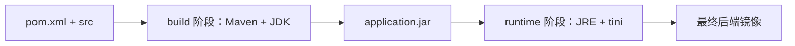

# Dockerfile 逐段解析

`Dockerfile` 回答的是一个问题：怎样从项目源码得到一个可以运行 Spring Boot 应用的 Docker 镜像？

本项目使用多阶段构建：第一阶段负责编译，第二阶段只负责运行。最终镜像不会包含 Maven、本项目源码或整个 `target` 目录。



## 1. 基础镜像参数

```dockerfile
ARG MAVEN_IMAGE=maven:3.9.0-eclipse-temurin-17@sha256:...
ARG RUNTIME_IMAGE=eclipse-temurin:17-jre-jammy@sha256:...
```

`ARG` 声明构建参数。这里允许 Compose 或命令行替换基础镜像，同时给出默认值。

一个完整镜像引用包含两部分：

```text
maven:3.9.0-eclipse-temurin-17 @ sha256:...
└──────────可读版本标签─────────┘   └─不可变摘要─┘
```

- 标签方便人阅读，说明 Maven 和 Java 大版本。
- digest 精确锁定镜像内容，避免同一个标签以后指向不同内容。
- `MAVEN_IMAGE` 只用于构建阶段。
- `RUNTIME_IMAGE` 用于最终运行阶段。

在 Compose 中，`platform: linux/amd64` 又进一步明确目标 CPU/操作系统平台。Apple Silicon 电脑会通过 Docker 的平台模拟能力运行这类镜像，因此通常比原生 arm64 慢。

## 2. 构建阶段

### 2.1 开始一个名为 `build` 的阶段

```dockerfile
FROM ${MAVEN_IMAGE} AS build
ARG MAVEN_OPTS
WORKDIR /workspace
```

- `FROM` 选择这一阶段的基础镜像。
- `AS build` 给阶段命名，后面可以使用 `--from=build` 取出构建产物。
- `ARG MAVEN_OPTS` 让当前阶段能够接收 Maven JVM 参数。
- `WORKDIR /workspace` 设置后续命令的工作目录；如果目录不存在，Docker 会创建它。

`MAVEN_OPTS` 只适合放不含凭据的 JVM 参数。Maven 仓库用户名、密码应通过受控的 `settings.xml` secret 提供，不能写进 Dockerfile、构建参数或 Git。

### 2.2 复制源码

```dockerfile
COPY pom.xml ./
COPY src ./src
```

`COPY` 左侧是构建上下文中的路径，右侧是镜像当前工作目录中的路径。构建上下文由 Compose 指定为项目根目录：

```yaml
build:
  context: .
```

因此 Docker 能看到根目录的 `pom.xml` 和 `src`。

构建上下文并不等于整个本机文件系统。Docker 只能复制上下文中的文件，并且还会应用 `.dockerignore`。本项目排除了 `.git`、IDE 配置、已有的 `target`、`.env` 和文档等内容：

- 减少发送给 Docker daemon 的数据量。
- 避免把本地编译结果误当成容器构建结果。
- 避免把真实 `.env` 凭据复制进构建上下文。
- 避免无关文件变化导致构建缓存失效。

### 2.3 使用缓存和临时 secret 完成 Maven 构建

```dockerfile
RUN --mount=type=cache,target=/root/.m2 \
    --mount=type=secret,id=maven_settings,target=/tmp/maven-settings.xml,required=false \
    if [ -f /tmp/maven-settings.xml ]; then MAVEN_SETTINGS="-s /tmp/maven-settings.xml"; else MAVEN_SETTINGS=""; fi \
    && mvn ${MAVEN_SETTINGS} -B -ntp -DskipTests package \
    && mv target/picture-zip-upload-*.jar target/application.jar
```

这一条 `RUN` 实际完成四件事。

#### Maven 本地仓库缓存

```dockerfile
--mount=type=cache,target=/root/.m2
```

Maven 下载的依赖会缓存到 BuildKit 管理的缓存中。以后再次构建时可以复用依赖，但这个缓存不会进入最终镜像。

首次构建仍然需要下载依赖；修改 Java 源码后再构建通常会更快。

#### 可选的 Maven `settings.xml`

```dockerfile
--mount=type=secret,id=maven_settings,target=/tmp/maven-settings.xml,required=false
```

构建时可以临时挂载公司 Maven 镜像配置：

```bash
docker build \
  --secret id=maven_settings,src=/secure/path/settings.xml \
  --tag picture-zip-upload:local .
```

这个文件只在当前构建步骤中可见，不会被 `COPY` 进镜像，也不会保留在最终镜像层中。`required=false` 表示不提供 secret 时仍可使用 Maven 默认配置构建。

#### 执行 Maven 打包

```bash
mvn ${MAVEN_SETTINGS} -B -ntp -DskipTests package
```

- `-B`：批处理模式，适合 CI 和 Docker 构建。
- `-ntp`：不显示 Maven 下载进度条，日志更简洁。
- `-DskipTests`：打包阶段不执行测试。
- `package`：编译并生成 Spring Boot JAR。

镜像构建跳过测试不代表项目不需要测试。正确流程是在构建发布镜像前单独运行：

```bash
mvn -B -ntp test
```

这样测试失败和镜像构建失败能够被清楚地区分。

#### 统一 JAR 文件名

```bash
mv target/picture-zip-upload-*.jar target/application.jar
```

Maven 产物文件名可能包含版本号。把它改成固定的 `application.jar` 后，运行阶段不需要知道 Maven 项目版本。

## 3. 运行阶段

### 3.1 从干净的 JRE 镜像重新开始

```dockerfile
FROM ${RUNTIME_IMAGE} AS runtime
```

第二个 `FROM` 开始了新的阶段。除非显式使用 `COPY --from=build`，第一个阶段中的 Maven、源码、缓存和临时文件都不会进入第二阶段。

运行 Java 程序只需要 JRE，不需要 Maven 和完整 JDK。这样可以减小最终镜像体积，也减少不必要的软件和攻击面。

### 3.2 创建非 root 用户和数据目录

```dockerfile
ARG APP_UID=10001
ARG APP_GID=10001

RUN apt-get update \
    && apt-get install --yes --no-install-recommends ca-certificates curl tini \
    && rm -rf /var/lib/apt/lists/* \
    && groupadd --gid "${APP_GID}" app \
    && useradd --uid "${APP_UID}" --gid "${APP_GID}" --create-home --shell /usr/sbin/nologin app \
    && install -d -o app -g app \
        /app \
        /data/picture-upload-work \
        /data/pictures \
        /data/corpusImages
```

安装的三个工具分别用于：

| 工具 | 用途 |
| --- | --- |
| `ca-certificates` | 让 Java/系统工具能够校验常见 HTTPS 证书链 |
| `curl` | 执行容器健康检查 |
| `tini` | 作为容器中的最小 init 进程，转发信号并回收子进程 |

`--no-install-recommends` 避免安装非必要推荐包。删除 `/var/lib/apt/lists/*` 可以减少镜像层中的包索引体积。

应用用户固定为 UID/GID `10001`：

- Java 进程不以 root 身份运行。
- 生产宿主机目录可以提前设置给 UID/GID `10001`。
- 容器内用户名是 `app`，但 Linux 文件权限真正比较的是数字 UID/GID。

`/usr/sbin/nologin` 表示这个用户不是为交互登录创建的。

需要特别注意：生产环境使用绑定挂载后，宿主机目录会遮住镜像内预先创建的同名目录。镜像中的目录权限不能替代宿主机权限，所以部署前仍需在宿主机执行目录权限检查。

### 3.3 复制唯一需要的构建产物

```dockerfile
WORKDIR /app
COPY --from=build --chown=app:app /workspace/target/application.jar ./application.jar
```

- `--from=build` 从第一个构建阶段读取文件。
- `--chown=app:app` 在复制时直接设置文件所有者。
- 最终镜像只接收打包后的 JAR，不接收项目源码。

### 3.4 设置镜像默认环境变量

```dockerfile
ENV JAVA_TOOL_OPTIONS="-XX:MaxRAMPercentage=75.0 -Dfile.encoding=UTF-8 -Duser.timezone=Asia/Shanghai" \
    SERVER_PORT=8080
```

这些是镜像默认值：

- `MaxRAMPercentage=75.0`：JVM 最多按容器可见内存的约 75% 规划堆，给线程栈、类元数据和本地内存留余量。
- `file.encoding=UTF-8`：统一默认字符编码。
- `user.timezone=Asia/Shanghai`：统一 JVM 时区。
- `SERVER_PORT=8080`：Spring Boot 默认监听 8080。

Compose 的 `environment` 可以覆盖 Dockerfile 中的 `ENV`。例如生产 Compose 把 `SERVER_PORT` 改为默认的 `18080`。

### 3.5 切换用户并声明端口

```dockerfile
USER app:app
EXPOSE 8080
```

`USER` 之后，健康检查和 Java 进程都以 `app` 用户运行。

`EXPOSE 8080` 只是镜像元数据，表达“应用通常监听 8080”。它不会自动把端口开放给宿主机。真正的端口可达性由 Compose 的 `ports` 或 `network_mode` 决定。

## 4. 健康检查

```dockerfile
HEALTHCHECK --interval=15s --timeout=5s --start-period=45s --retries=5 \
    CMD curl --fail --silent --show-error "http://127.0.0.1:${SERVER_PORT}/actuator/health" >/dev/null || exit 1
```

Docker 会在容器内部定期访问 Spring Boot Actuator：

- `interval=15s`：每 15 秒检查一次。
- `timeout=5s`：单次检查最多等待 5 秒。
- `start-period=45s`：启动后的前 45 秒作为预热期。
- `retries=5`：连续失败 5 次后标记为 `unhealthy`。
- `curl --fail`：HTTP 4xx/5xx 会返回失败退出码。

健康状态可以通过下面的命令查看：

```bash
docker compose ... ps
docker inspect --format '{{json .State.Health}}' 容器名
```

健康检查失败不会自动证明 Java 进程已经退出，它表示“容器中的应用未能按预期提供健康接口”。下一步应查看 `backend` 日志。

维护任务不是 Web 应用，因此 `compose.yaml` 对 `maintenance` 服务显式禁用了这个健康检查。

## 5. 启动入口

```dockerfile
ENTRYPOINT ["/usr/bin/tini", "--", "java", "-jar", "/app/application.jar"]
```

容器启动后的进程关系是：

```text
tini
└── java -jar /app/application.jar
```

使用 JSON 数组形式可以避免额外的 shell 层，并让停止信号更直接地传给进程。`tini` 会把 Docker 发送的 `SIGTERM` 转发给 Java；Spring Boot 再按照优雅停机配置处理正在执行的请求。

Compose 中的 `stop_grace_period: 60s` 给应用最多 60 秒完成优雅停机。超时后 Docker 才会强制结束进程。

## 6. 构建时发生了什么

执行：

```bash
docker compose --env-file .env \
  -f compose.yaml -f compose.local.yaml \
  build backend
```

可以按下面的顺序理解：

1. Compose 读取 `.env`，替换 `MAVEN_IMAGE`、`APP_UID` 等构建变量。
2. Docker 读取 `.dockerignore`，确定构建上下文包含哪些文件。
3. BuildKit 创建 `build` 阶段并运行 Maven。
4. Maven 产出 `application.jar`。
5. BuildKit 创建 `runtime` 阶段，只复制 JAR。
6. 最终镜像被标记为 `.env` 中的 `BACKEND_IMAGE`，默认是 `picture-zip-upload:local`。

构建镜像不会自动启动应用。启动容器需要继续执行 `docker compose ... up`。

## 7. 常见疑问

### 为什么 Dockerfile 不运行测试？

项目测试应作为独立质量门执行，镜像构建专注生成可运行产物。这样 Maven 测试结果和 Docker 构建结果更容易定位。发布前两者都要执行。

### 为什么不能直接把本机打好的 JAR 复制进去？

容器内构建能减少“我的电脑上可以”的环境差异，并让构建过程由 Dockerfile 完整描述。`.dockerignore` 也特意排除了本机 `target`。

### 为什么固定 UID/GID？

生产绑定挂载要依赖 Linux 数字权限。固定 `10001` 后，宿主机可以在容器启动前明确准备目录所有者，避免应用以 root 身份运行。

### 为什么既有 `ENTRYPOINT` 又有 `tini`？

`ENTRYPOINT` 定义容器默认启动命令；`tini` 是这条命令中的第一个进程，负责容器环境中的信号和子进程管理。
