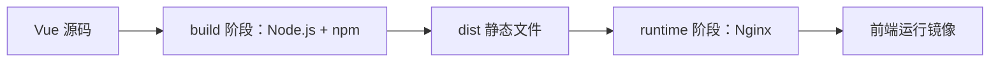
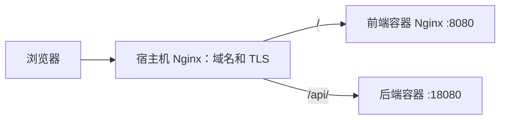

# 前端 Dockerfile 样例逐段解析

本文解释的是 [`docker/frontend/Dockerfile.example`](../../docker/frontend/Dockerfile.example)。它是提供给独立 Vue 3 前端仓库的模板，不是当前后端仓库的实际构建入口。

当前仓库没有 Vue 源码、`package.json` 或 `package-lock.json`，所以不能在这里直接构建这个样例。正确用法是把两个模板复制到真实 Vue 仓库：

```text
picture-zip-upload/docker/frontend/Dockerfile.example
    → Vue 仓库/Dockerfile

picture-zip-upload/docker/frontend/nginx.conf.example
    → Vue 仓库/docker/nginx.conf
```

复制完成后，预期的 Vue 仓库结构类似：

```text
vue-project/
├── Dockerfile
├── package.json
├── package-lock.json
├── src/
├── public/
└── docker/
    └── nginx.conf
```

## 1. 这个镜像解决什么问题

Vue 项目在开发时通常由 Node.js 开发服务器运行，但正式构建后只是一组 HTML、JavaScript、CSS 和图片等静态文件。生产容器不需要继续运行 Node.js。

因此样例使用两个构建阶段：



- `build` 阶段安装 npm 依赖并执行前端构建。
- `runtime` 阶段只复制 `dist`，由 Nginx 提供静态文件。
- 最终镜像不包含 Node.js、npm、完整源码或 `node_modules`。

这种结构与后端 Dockerfile 的思路相同：构建工具留在第一阶段，最终镜像只保留运行时真正需要的内容。

## 2. 当前 `# syntax` 行的实际含义

```dockerfile
# syntax=docker/dockerfile:1.7
```

这行文字看起来像 Dockerfile parser directive，本来的写法意图应是选择 Dockerfile 1.7 语法前端，以明确支持后面的缓存挂载：

```dockerfile
RUN --mount=type=cache,target=/root/.npm npm ci
```

但在当前样例中，它前面已经有两行普通注释。根据 [Dockerfile parser directives 规则](https://docs.docker.com/reference/dockerfile/#parser-directives)，BuildKit 处理过普通注释后就不再寻找 parser directive，所以当前第 3 行只是一行普通注释，并不会显式拉取或固定 `docker/dockerfile:1.7`。

当前构建实际使用 BuildKit 自带的 Dockerfile frontend。`RUN --mount=type=cache` 仍然依赖 BuildKit，现有部署指南已经要求 Docker Engine 24+、BuildKit 和 Docker Compose v2。

这里保留模板原样，不在解释文档任务中改变其构建网络行为。如果将来确实需要显式固定 syntax frontend，必须把 `# syntax=...` 移到 Dockerfile 第一行；同时要注意 BuildKit 可能需要拉取对应 frontend 镜像。若公司构建网络不允许该拉取，继续使用已验证的内置 frontend 更合适。

## 3. 模板使用提示

```dockerfile
# Copy this file to the Vue repository as Dockerfile.
# Keep docker/nginx.conf beside it as docker/nginx.conf.
```

这两行是普通注释，只用于提醒复制后的文件位置。它们不参与镜像构建。

第二行所说的 `docker/nginx.conf` 是相对于 Vue 仓库构建上下文的路径。后面存在：

```dockerfile
COPY docker/nginx.conf /etc/nginx/nginx.conf
```

如果只复制 Dockerfile，没有把 `nginx.conf.example` 复制成 `docker/nginx.conf`，构建会在这条 `COPY` 处失败。

文件名也很重要：Docker 默认寻找名为 `Dockerfile` 的文件，不会自动选择 `Dockerfile.example`。模板复制到 Vue 仓库后需要去掉 `.example` 后缀。

## 4. 两个基础镜像

```dockerfile
ARG NODE_IMAGE=node:24.13.0-bookworm-slim@sha256:...
ARG NGINX_IMAGE=nginx:1.28.0-alpine@sha256:...
```

这两个全局 `ARG` 允许在构建时替换基础镜像，同时提供经过固定的默认值。

| 参数 | 所属阶段 | 作用 |
| --- | --- | --- |
| `NODE_IMAGE` | `build` | 提供 Node.js、npm 和前端构建环境 |
| `NGINX_IMAGE` | `runtime` | 提供最终静态文件服务器 |

镜像引用同时包含可读标签和不可变 digest：

```text
node:24.13.0-bookworm-slim @ sha256:...
└────────可读版本标签────────┘   └─不可变内容摘要─┘
```

- `bookworm-slim` 表示精简的 Debian Bookworm 变体。
- `alpine` 表示体积较小的 Alpine Linux 变体。
- digest 避免同一个标签以后指向不同的镜像内容。

如果公司要求从内部镜像仓库构建，可以通过 `--build-arg` 替换：

```bash
docker build \
  --build-arg NODE_IMAGE=registry.example.com/library/node:24.13.0-bookworm-slim \
  --build-arg NGINX_IMAGE=registry.example.com/library/nginx:1.28.0-alpine \
  --tag picture-zip-upload-frontend:local .
```

构建参数不适合传入 npm token、仓库密码等秘密信息。私有 npm 仓库凭据应使用 BuildKit secret 或 CI 提供的受控机制，并确保不会被复制到镜像层。

## 5. `build` 阶段：构建 Vue 静态文件

### 5.1 开始 Node.js 构建阶段

```dockerfile
FROM ${NODE_IMAGE} AS build
WORKDIR /workspace
```

- `FROM` 使用 Node.js 基础镜像开始一个新阶段。
- `AS build` 把该阶段命名为 `build`，供后面 `COPY --from=build` 引用。
- `WORKDIR /workspace` 设置后续 `COPY`、`RUN` 等指令的工作目录。

在这个阶段中，目录结构最终类似：

```text
/workspace/
├── package.json
├── package-lock.json
├── node_modules/
├── src/
└── dist/
```

它只是构建过程中的文件系统，不会被整体复制进最终镜像。

### 5.2 先只复制依赖清单

```dockerfile
COPY package.json package-lock.json ./
```

这条指令故意没有立刻执行 `COPY . .`，目的是提高构建缓存命中率。

Docker 按层缓存构建结果：

1. 当 `package.json` 和 `package-lock.json` 没有变化时，这个 `COPY` 层可以复用。
2. 下一步的 `npm ci` 也有机会复用缓存。
3. 只修改 `.vue`、`.ts` 或 `.css` 文件时，不必重新解析全部 npm 依赖。

如果一开始就复制整个项目，任意源码变化都可能使依赖安装层失效，构建会明显变慢。

### 5.3 使用缓存执行 `npm ci`

```dockerfile
RUN --mount=type=cache,target=/root/.npm npm ci
```

这条指令包含两部分。

#### npm 下载缓存

```dockerfile
--mount=type=cache,target=/root/.npm
```

BuildKit 为 npm 缓存目录提供可复用缓存。后续构建可以复用已下载的包，减少网络请求。

这个缓存：

- 不会进入最终 Nginx 镜像。
- 不等于把本机 `node_modules` 复制进容器。
- 可能被 Docker 的构建缓存清理命令删除。
- 首次构建仍需要从 npm 仓库下载依赖。

#### 为什么使用 `npm ci`

`npm ci` 面向 CI 和可重复构建：

- 要求仓库存在 `package-lock.json`。
- 要求 lock 文件与 `package.json` 一致，不一致时直接失败。
- 严格按照 lock 文件中的依赖版本安装。
- 不会在镜像构建时顺手改写并产生一个新的 lock 文件。

因此模板不能直接用于只有 `package.json`、没有 `package-lock.json` 的前端仓库。应先在受控 Node.js 环境中生成并提交正确的 lock 文件，而不是把 Dockerfile 改成不受锁定的安装方式。

### 5.4 再复制其余前端源码

```dockerfile
COPY . .
```

这里的第一个 `.` 表示 Vue 仓库的 Docker 构建上下文，第二个 `.` 表示当前工作目录 `/workspace`。

Docker 会复制构建上下文中的所有未被 `.dockerignore` 排除的内容。真实 Vue 仓库应准备自己的 `.dockerignore`，通常至少排除：

```dockerignore
.git
.idea
node_modules
dist
.env
.env.*
npm-debug.log*
```

需要根据前端项目实际情况保留可提交的环境变量示例文件。当前后端仓库的 `.dockerignore` 不会在另一个 Vue 仓库中自动生效。

排除 `node_modules` 尤其重要，因为本机依赖可能来自 macOS/Windows 或不同 CPU 架构，不能覆盖容器内由 `npm ci` 安装的 Linux 依赖。

### 5.5 执行正式构建

```dockerfile
RUN npm run build
```

它等价于执行 `package.json` 中 `scripts.build` 对应的命令。对于常见 Vue 3 + Vite 项目，构建结果默认位于：

```text
/workspace/dist
```

模板后面固定从这个目录复制文件。如果项目修改了 Vite 的 `build.outDir`，也必须同步修改 Dockerfile 中的 `/workspace/dist/`。

前端构建通常会进行：

- Vue/TypeScript 编译。
- 模块打包和 tree shaking。
- 文件压缩。
- 生成带内容哈希的静态资源文件名。
- 产生入口 `index.html`。

#### 前端环境变量是构建时配置

Vite 的 `VITE_*` 环境变量通常会在 `npm run build` 时写入静态 JavaScript。镜像构建完成后，再通过 `docker run -e VITE_API_URL=...` 设置变量，不会自动重写已经生成的静态文件。

本项目建议前端调用相对路径 `/api`，由外层宿主机 Nginx 转发到后端。这样同一个前端镜像通常不必为每个域名重新写入完整后端地址。

## 6. `runtime` 阶段：使用 Nginx 提供静态文件

### 6.1 从干净的 Nginx 镜像重新开始

```dockerfile
FROM ${NGINX_IMAGE} AS runtime
```

第二个 `FROM` 开始全新的文件系统。Node.js 阶段中的下面这些内容默认都不会进入最终镜像：

- Node.js 和 npm。
- Vue 源码。
- `node_modules`。
- npm 下载缓存。
- 构建日志和临时文件。

只有后面显式复制的 Nginx 配置和 `dist` 会进入运行镜像。

### 6.2 删除默认站点并准备目录

```dockerfile
RUN rm -f /etc/nginx/conf.d/default.conf \
    && install -d -o nginx -g nginx \
        /var/cache/nginx \
        /var/run \
        /usr/share/nginx/html
```

官方 Nginx 镜像自带默认站点配置。模板要使用完整的自定义 `/etc/nginx/nginx.conf`，所以先删除 `/etc/nginx/conf.d/default.conf`，避免默认 80 端口站点和自定义站点同时存在或产生混淆。

`install -d` 创建目录并直接指定 owner/group 为 `nginx`：

- `/var/cache/nginx`：Nginx 缓存相关目录。
- `/var/run`：部分 Nginx 运行时文件可能使用的目录。
- `/usr/share/nginx/html`：最终静态文件根目录。

后面容器会切换成非 root 的 `nginx` 用户，因此需要提前准备权限。

### 6.3 复制 Nginx 配置

```dockerfile
COPY docker/nginx.conf /etc/nginx/nginx.conf
```

左侧文件必须位于 Vue 仓库的 `docker/nginx.conf`。它来源于当前仓库的 `docker/frontend/nginx.conf.example`，各项 Nginx 指令详见 [前端容器 Nginx 配置逐段解析](05-frontend-nginx-conf-explained.md)。

该配置专门为非 root 容器调整：

- PID 写到 `/tmp/nginx.pid`。
- 临时请求和代理目录写到 `/tmp`。
- 监听非特权端口 `8080`，而不是 `80`。
- 访问日志写到标准输出。
- 错误日志写到标准错误。

因此 Docker 可以通过 `docker logs` 收集日志，Nginx 也不需要 root 权限绑定 80 端口或写系统目录。

### 6.4 从构建阶段复制 `dist`

```dockerfile
COPY --from=build --chown=nginx:nginx /workspace/dist/ /usr/share/nginx/html/
```

- `--from=build` 从 Node.js 构建阶段取文件。
- `/workspace/dist/` 是前端构建产物目录。
- `/usr/share/nginx/html/` 是 Nginx 静态文件根目录。
- `--chown=nginx:nginx` 在复制时把文件所有者设为运行用户。

末尾斜杠表达“复制目录中的内容”。最终应得到类似：

```text
/usr/share/nginx/html/
├── index.html
├── assets/
│   ├── index-<hash>.js
│   └── index-<hash>.css
└── ...
```

如果 `npm run build` 没有生成 `/workspace/dist`，镜像构建会在这里失败，而不是得到一个空站点镜像。

### 6.5 使用非 root 用户和 8080 端口

```dockerfile
USER nginx:nginx
EXPOSE 8080
```

`USER` 使后面的健康检查和 Nginx 主进程都以镜像内置的 `nginx` 用户运行。

非 root 进程通常不能直接监听 1024 以下的特权端口，因此自定义配置监听 8080。`EXPOSE 8080` 只是镜像元数据，不会自动向宿主机开放端口。

真正开放端口需要 `docker run -p` 或前端仓库的 Compose 配置，例如：

```text
127.0.0.1:18081:8080
└─宿主机地址和端口─┘ └容器端口┘
```

这表示宿主机 Nginx 可以访问 `127.0.0.1:18081`，而前端容器中的 Nginx 仍监听 8080。

## 7. 健康检查

```dockerfile
HEALTHCHECK --interval=15s --timeout=5s --start-period=10s --retries=3 \
    CMD wget --quiet --tries=1 --spider http://127.0.0.1:8080/healthz || exit 1
```

Docker 每隔一段时间从容器内部访问 `/healthz`：

| 参数 | 含义 |
| --- | --- |
| `interval=15s` | 每 15 秒检查一次 |
| `timeout=5s` | 单次检查最多等待 5 秒 |
| `start-period=10s` | 启动后的前 10 秒作为预热时间 |
| `retries=3` | 连续失败 3 次后标记为 `unhealthy` |

`wget --spider` 只检查资源是否可访问，不下载并保存页面内容。Nginx 配置中的对应接口为：

```nginx
location = /healthz {
    access_log off;
    default_type text/plain;
    return 200 "ok\n";
}
```

它不依赖 `index.html`，能够直接验证 Nginx 进程和监听端口是否正常。关闭该路径的访问日志可以避免每 15 秒产生一条无价值日志。

健康检查只证明前端静态服务器可响应，不证明后端 API、数据库或完整业务链路正常。

## 8. Nginx 启动命令

```dockerfile
CMD ["nginx", "-g", "daemon off;"]
```

Nginx 默认可能以 daemon 方式转入后台，但容器需要一个持续运行的前台主进程。`daemon off;` 让 Nginx 保持前台运行：

```text
容器主进程 = nginx master process
```

当 Docker 停止容器时，停止信号能够发送给 Nginx 主进程。Nginx 退出后，容器生命周期也随之结束。

这里使用 JSON 数组形式，Docker 会直接启动 Nginx，不额外经过 `/bin/sh -c`。

## 9. `nginx.conf` 如何提供 Vue 单页应用

前端 Dockerfile 和 `nginx.conf` 是一组模板，缺少任意一个都不能得到预期镜像。

### 9.1 静态文件根目录

```nginx
root /usr/share/nginx/html;
index index.html;
```

这与 Dockerfile 复制 `dist` 的目标目录完全一致。

### 9.2 带 hash 的资源长期缓存

```nginx
location /assets/ {
    try_files $uri =404;
    expires 1y;
    add_header Cache-Control "public, immutable";
}
```

Vite 通常为构建产物生成带内容 hash 的文件名。内容变化时文件名也变化，因此旧文件可以安全地长期缓存。

请求不存在的 `/assets/...` 时直接返回 404，不回退到 `index.html`，避免把 HTML 错当成 JavaScript 或 CSS。

### 9.3 Vue Router history 模式回退

```nginx
location / {
    try_files $uri $uri/ /index.html;
}
```

例如用户直接刷新 `/tasks/123`：

1. Nginx 先检查是否有真实文件 `/tasks/123`。
2. 找不到时返回 `/index.html`。
3. Vue Router 在浏览器中读取 URL 并渲染对应页面。

没有这个回退时，首页可能正常，但刷新前端子路由会得到 Nginx 404。

### 9.4 为什么容器 Nginx 不代理 `/api`

这个前端容器只负责静态文件。生产环境的宿主机 Nginx 负责统一入口和路由，完整配置关系详见 [宿主机 Nginx 路由配置逐段解析](06-host-nginx-routing-explained.md)：



因此：

- 容器 Nginx：提供 `dist`、SPA fallback 和 `/healthz`。
- 宿主机 Nginx：终止 HTTPS、路由 `/api`、路由图片地址并转发到前后端。

如果直接通过 `http://127.0.0.1:18081` 打开前端容器，静态页面可以访问，但同源 `/api` 请求不会自动到达后端。完整联调需要使用宿主机 Nginx、单独的本地反向代理，或前端开发服务器的 proxy。

## 10. 在真实 Vue 仓库中的使用步骤

下面的命令应在真实 Vue 仓库根目录执行，而不是当前后端仓库。

### 10.1 复制模板

```bash
BACKEND_REPO=/path/to/picture-zip-upload

cp "$BACKEND_REPO/docker/frontend/Dockerfile.example" ./Dockerfile
mkdir -p docker
cp "$BACKEND_REPO/docker/frontend/nginx.conf.example" ./docker/nginx.conf
```

确认关键文件存在：

```bash
test -f Dockerfile
test -f docker/nginx.conf
test -f package.json
test -f package-lock.json
```

### 10.2 构建镜像

```bash
docker build --tag picture-zip-upload-frontend:local .
```

命令末尾的 `.` 表示 Vue 仓库根目录是构建上下文。如果在错误目录运行，Docker 会找不到 `package.json`、源码或 `docker/nginx.conf`。

### 10.3 只验证静态站点

```bash
docker run --detach --rm \
  --name picture-zip-upload-frontend \
  --publish 127.0.0.1:18081:8080 \
  picture-zip-upload-frontend:local

curl --fail http://127.0.0.1:18081/healthz
curl --fail http://127.0.0.1:18081/
docker logs picture-zip-upload-frontend
docker stop picture-zip-upload-frontend
```

这只能验证 Nginx、健康接口和静态首页。它不验证 `/api` 到后端的完整路由。

## 11. 构建缓存怎样失效

理解缓存有助于判断一次重新构建为什么变慢：

| 发生变化的文件 | 通常需要重新执行的步骤 |
| --- | --- |
| `src/**/*.vue`、`src/**/*.ts`、CSS | `COPY . .` 之后和 `npm run build` |
| `package.json` 或 `package-lock.json` | `npm ci` 及其后的所有步骤 |
| `docker/nginx.conf` | 运行阶段的配置复制及其后步骤 |
| Node 基础镜像 | 整个 Node 构建阶段 |
| Nginx 基础镜像 | 整个 Nginx 运行阶段 |

`--no-cache` 会强制不复用普通构建层，但 BuildKit cache mount 有独立生命周期。日常构建不需要习惯性添加 `--no-cache`；遇到缓存疑问时应先查看构建日志中哪些步骤显示为 `CACHED`。

## 12. 常见问题

### `npm ci` 提示缺少 lock 文件

模板要求 `package-lock.json`。应在与项目兼容的 Node/npm 环境中生成并提交 lock 文件，再构建镜像。

### `npm ci` 提示 `package.json` 与 lock 文件不一致

说明依赖清单发生变化后没有同步 lock 文件。应在开发环境运行正确的依赖安装命令、审查 lock 文件变化并提交，不能在 Dockerfile 中绕过一致性检查。

### `COPY docker/nginx.conf` 失败

检查：

- 是否从真实 Vue 仓库根目录执行 `docker build ... .`。
- 是否创建了 `docker/` 目录。
- 是否把 `nginx.conf.example` 复制并改名为 `docker/nginx.conf`。
- Vue 仓库的 `.dockerignore` 是否误排除了该文件。

### `COPY --from=build ... /workspace/dist` 失败

先看 `npm run build` 日志，再检查前端构建输出目录。若项目配置了非默认 `outDir`，需要让 Dockerfile 复制路径与它一致。

### 容器启动后显示默认 Nginx 页面

通常表示没有使用这份 Dockerfile、镜像标签指向旧镜像，或默认配置没有被替换。查看镜像构建日志和容器实际使用的 image ID。

### 首页正常，刷新子路由却返回 404

检查容器内是否使用模板 `nginx.conf`，以及 `location /` 是否保留 `try_files $uri $uri/ /index.html`。

### 容器健康检查失败

```bash
docker logs picture-zip-upload-frontend
docker exec picture-zip-upload-frontend wget -qO- http://127.0.0.1:8080/healthz
```

重点检查 Nginx 是否成功读取配置、是否监听 8080，以及 `/healthz` location 是否存在。

### 页面可以访问，但 API 返回 404

直接访问前端容器时，它不会代理 `/api`。应检查外层宿主机 Nginx 或本地反向代理，而不是给静态容器随意添加后端地址。

## 13. 与后端 Dockerfile 的对照

| 对比项 | 后端 Dockerfile | 前端 Dockerfile 样例 |
| --- | --- | --- |
| 构建工具 | Maven + JDK | Node.js + npm |
| 构建输入 | `pom.xml`、`src` | `package.json`、lock 文件、Vue 源码 |
| 构建产物 | `application.jar` | `dist/` 静态文件 |
| 最终运行时 | Java JRE | Nginx |
| 最终主进程 | `java -jar ...` | `nginx -g 'daemon off;'` |
| 运行用户 | `app`，UID/GID 10001 | 镜像内置 `nginx` 用户 |
| 健康接口 | Spring Actuator `/actuator/health` | Nginx `/healthz` |
| 最终镜像是否含构建工具 | 不含 Maven/JDK | 不含 Node.js/npm |

两者都使用多阶段构建、固定基础镜像、非 root 运行和 HTTP 健康检查，但最终提供的服务不同：后端运行 Java API，前端只提供静态资源。

## 14. 修改模板时的检查清单

- 是否需要显式固定 syntax frontend；如果需要，`# syntax=...` 必须位于第一行，并确认构建环境能拉取对应 frontend。
- Vue 仓库是否存在并提交了 `package-lock.json`。
- `npm run build` 的输出目录是否仍为 `dist`。
- `.dockerignore` 是否排除了 `node_modules`、`dist` 和真实 `.env`。
- `docker/nginx.conf` 是否仍能被构建上下文访问。
- Nginx 是否继续以非 root 用户监听 8080。
- `/healthz` 是否与 Dockerfile 健康检查一致。
- Vue Router history fallback 是否仍保留。
- 前端是否继续使用适合部署拓扑的相对 `/api` 地址。
- 正式镜像是否使用不可变版本或公司镜像仓库引用。
