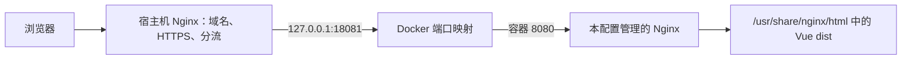

# 前端容器 Nginx 配置逐段解析

本文解释 [`docker/frontend/nginx.conf.example`](../../docker/frontend/nginx.conf.example)。它是一份完整的容器内 Nginx 主配置模板，用于把 Vue 3 构建产生的 `dist` 静态文件提供给浏览器。

它不负责：

- 公网域名和 HTTPS 证书。
- 把 `/api` 请求转发给 Java 后端。
- 直接读取后端的图片目录。
- 替代生产服务器上现有的宿主机 Nginx。

这些外部入口和请求分流职责由宿主机 Nginx 承担，详见 [宿主机 Nginx 路由配置逐段解析](06-host-nginx-routing-explained.md)。

## 1. 它在整个部署链路中的位置



生产建议把前端容器端口映射为：

```text
127.0.0.1:18081:8080
└────宿主机────┘ └容器┘
```

因此：

- 前端容器里的 Nginx 监听 8080。
- 宿主机通过 `127.0.0.1:18081` 找到前端容器。
- 公网用户不能绕过宿主机 Nginx 直接访问容器端口。

## 2. 先认识 Nginx 配置层级

Nginx 配置由“指令”和“块”组成：

```nginx
directive value;

block {
    directive value;
}
```

普通指令以分号结束，块使用花括号包含下一层配置。当前文件的层级为：

```text
main（最外层）
├── worker_processes
├── pid
├── events
│   └── worker_connections
└── http
    ├── MIME、日志、文件发送和临时目录
    └── server
        ├── listen、server_name、root、index
        └── location
            ├── = /healthz
            ├── /assets/
            └── /
```

指令只能写在它允许的上下文中。例如 `worker_connections` 必须位于 `events`，`location` 必须位于 `server`，不能只看指令名字随意移动。

## 3. 主进程与 worker 进程

### 3.1 自动决定 worker 数量

```nginx
worker_processes auto;
```

Nginx 通常由一个 master process 管理若干 worker process：

```text
nginx master process
├── nginx worker process
├── nginx worker process
└── ...
```

`auto` 让 Nginx 自动探测可用 CPU 数量，并据此选择 worker 数量。对于静态文件服务器，这是一个合理的通用默认值，不需要新手手工写死为 1、2 或 4。

worker 数量并不直接等于并发请求上限；还会受到连接数、文件描述符、容器 CPU/内存限制和实际负载影响。

### 3.2 把 PID 文件写入 `/tmp`

```nginx
pid /tmp/nginx.pid;
```

PID 文件记录 Nginx master process 的进程号，reload、stop 等信号操作会使用它。

官方镜像的默认 PID 位置可能位于普通用户不可写的系统目录。本项目让容器以非 root `nginx` 用户运行，因此把 PID 文件放进可写的 `/tmp`。

这与前端 Dockerfile 中的配置配合：

```dockerfile
USER nginx:nginx
```

如果改回 `/var/run/nginx.pid`，必须同时确认非 root 用户有写权限，否则 Nginx 可能在启动时直接失败。

## 4. `events`：连接处理设置

```nginx
events {
    worker_connections 1024;
}
```

`events` 是连接处理配置上下文。

`worker_connections 1024` 表示每个 worker process 最多可同时打开 1024 个连接。它不是“整个容器最多只能处理 1024 个 HTTP 请求”，原因包括：

- 限制按 worker 计算。
- 一个 keep-alive 连接可以先后承载多个请求。
- 连接数统计包括客户端连接，也包括代理上游连接；当前前端容器不做代理，所以主要是客户端连接。
- 实际上限仍不能超过进程的文件描述符限制。

对当前只提供静态文件的小型前端容器而言，1024 是保守、容易理解的基线。是否需要提高应依据监控和压测，而不是看到数字后直接放大。

## 5. `http`：HTTP 服务的公共配置

```nginx
http {
    ...
}
```

`http` 块包含所有 HTTP 虚拟服务器和它们共享的设置。当前文件只有一个 `server`。

### 5.1 MIME 类型

```nginx
include /etc/nginx/mime.types;
default_type application/octet-stream;
```

浏览器不只关心文件内容，还会读取响应头中的 `Content-Type`：

| 文件 | 常见 Content-Type |
| --- | --- |
| `.html` | `text/html` |
| `.css` | `text/css` |
| `.js` | `application/javascript` |
| `.svg` | `image/svg+xml` |

`include /etc/nginx/mime.types` 加载官方镜像提供的“扩展名 → MIME 类型”映射。

`default_type application/octet-stream` 是找不到扩展名映射时的后备值，含义接近“通用二进制数据”。它不会把所有文件都改成二进制类型；只有没有匹配 MIME 映射时才使用。

如果 JavaScript 被错误地以 `text/html` 返回，浏览器常会报告模块 MIME 类型错误。排查时既要检查 `mime.types`，也要检查请求是否被 SPA fallback 错误地返回了 `index.html`。

### 5.2 把日志交给 Docker

```nginx
access_log /dev/stdout;
error_log /dev/stderr warn;
```

- `access_log` 记录请求路径、状态码、响应大小等访问信息。
- `error_log` 记录配置、文件访问和运行错误。
- `warn` 表示记录 `warn` 以及比它更严重的级别。

容器不把日志长期写进自己的文件系统，而是写到标准输出和标准错误。Docker 可以统一收集：

```bash
docker logs picture-zip-upload-frontend
docker logs --follow picture-zip-upload-frontend
```

这样容器重建不会把日志文件留在镜像可写层中，日志轮转或集中采集也可以交给 Docker/宿主机平台。

### 5.3 使用 `sendfile`

```nginx
sendfile on;
```

`sendfile` 允许 Nginx 使用操作系统的 `sendfile()` 机制发送静态文件，减少用户态复制。它适合当前“读取 `dist` 文件并发送给浏览器”的用途。

它不会压缩文件。当前模板没有配置 gzip 或 Brotli；是否增加压缩应结合宿主机 Nginx、静态资源预压缩和公司统一策略另行决定，避免两层 Nginx 重复压缩。

### 5.4 客户端 keep-alive

```nginx
keepalive_timeout 65;
```

这里的单位默认是秒。请求完成后，Nginx 最多让客户端 HTTP keep-alive 连接空闲保持 65 秒，以便浏览器复用同一 TCP 连接继续请求 JS、CSS、图片等资源。

这是“浏览器 ↔ 前端容器 Nginx”的连接设置，不是“宿主机 Nginx ↔ 上游服务”的 `upstream keepalive`。两个同名概念处于不同链路，不能混为一谈。

## 6. 为什么所有临时目录都指向 `/tmp`

```nginx
client_body_temp_path /tmp/client_body;
proxy_temp_path /tmp/proxy;
fastcgi_temp_path /tmp/fastcgi;
uwsgi_temp_path /tmp/uwsgi;
scgi_temp_path /tmp/scgi;
```

这些指令指定不同协议模块需要落盘临时数据时使用的目录：

| 指令 | 对应场景 |
| --- | --- |
| `client_body_temp_path` | 客户端请求体临时文件 |
| `proxy_temp_path` | HTTP 反向代理响应临时文件 |
| `fastcgi_temp_path` | FastCGI 临时文件 |
| `uwsgi_temp_path` | uWSGI 临时文件 |
| `scgi_temp_path` | SCGI 临时文件 |

当前前端配置只提供静态文件，并没有 `proxy_pass`、FastCGI、uWSGI 或 SCGI，所以多数目录通常不会实际使用。模板仍显式把它们放到 `/tmp`，是为了：

- 兼容非 root 用户。
- 避免未来启用相关模块时尝试写入不可写系统目录。
- 适配只读根文件系统加可写 `/tmp` 的容器安全模式。

如果未来给容器设置 `read_only: true`，必须确保 `/tmp` 仍是可写 tmpfs，并允许 `nginx` 用户写入。

## 7. `server`：容器中的静态站点

```nginx
server {
    listen 8080;
    server_name _;
    root /usr/share/nginx/html;
    index index.html;
    ...
}
```

一个 `server` 块描述一个虚拟服务器。

### 7.1 监听 8080

```nginx
listen 8080;
```

容器内 Nginx 监听所有容器网络接口的 8080 端口。

选择 8080 而不是 80，是因为 Linux 普通用户通常不能绑定 1024 以下的特权端口。Dockerfile 已切换到非 root `nginx` 用户，所以 8080 是直接、稳妥的选择。

`listen 8080` 不等于宿主机自动开放 8080。宿主机端口仍由 Docker `--publish` 或 Compose `ports` 决定。

### 7.2 `server_name _` 不是通配符

```nginx
server_name _;
```

下划线不是 Nginx 的特殊“匹配所有域名”语法。它只是一个通常不会成为真实域名的占位名字。

当前配置在 8080 上只有这一个 `server`，因此它自然成为该监听端口的默认虚拟服务器，能够处理宿主机 Nginx 转发来的请求。不要把 `_` 理解为类似 shell `*` 的通配符。

### 7.3 静态文件根目录

```nginx
root /usr/share/nginx/html;
index index.html;
```

前端 Dockerfile 把 Vue 构建产物复制到同一个目录：

```dockerfile
COPY --from=build --chown=nginx:nginx \
  /workspace/dist/ /usr/share/nginx/html/
```

`root` 会把请求 URI 拼到根目录后面。例如：

```text
请求 /assets/app-123.js
  → /usr/share/nginx/html/assets/app-123.js
```

`index index.html` 表示请求映射到目录时，优先寻找 `index.html`。

## 8. Nginx 怎样选择三个 `location`

当前文件没有正则 location，匹配逻辑可以简化为：

1. `location = /healthz` 只匹配完全等于 `/healthz` 的 URI，并立即结束查找。
2. 其他请求在普通前缀 location 中选择最长匹配前缀。
3. `/assets/...` 比 `/` 更长，所以进入资源缓存规则。
4. 其余所有以 `/` 开头的请求进入通用 SPA 规则。

| 请求 | 最终 location |
| --- | --- |
| `/healthz` | `location = /healthz` |
| `/healthz/` | `location /` |
| `/assets/app.js` | `location /assets/` |
| `/assets` | `location /` |
| `/` | `location /` |
| `/tasks/123` | `location /` |
| `/api/tasks` | `location /` |

最后一行很重要：前端容器本身没有 `/api` 代理规则。直接请求它的 `/api/tasks` 会进入 SPA fallback，很可能返回 `index.html`，而不是 Java API 响应。

## 9. `/healthz`：容器健康检查

```nginx
location = /healthz {
    access_log off;
    default_type text/plain;
    return 200 "ok\n";
}
```

逐项解释：

- `=`：只匹配完全相同的 `/healthz`。
- `access_log off`：Docker 每 15 秒检查一次，关闭访问日志可避免产生大量重复记录。
- `default_type text/plain`：返回普通文本类型。
- `return 200 "ok\n"`：不访问磁盘文件，直接返回 HTTP 200 和正文 `ok`。

前端 Dockerfile 中的健康检查与它严格对应：

```dockerfile
HEALTHCHECK ... \
  CMD wget --quiet --tries=1 --spider \
      http://127.0.0.1:8080/healthz || exit 1
```

这个健康检查能够证明：

- Nginx 进程已启动。
- 配置成功加载。
- 8080 端口正在响应。

它不能证明：

- `dist/index.html` 一定存在。
- 某个 JS 文件没有损坏。
- 宿主机 Nginx 路由正确。
- Java 后端、MySQL 或 Redis 正常。

因此 `/healthz` 是容器存活/基础就绪检查，不是完整业务验收。

## 10. `/assets/`：带 hash 静态资源的缓存

```nginx
location /assets/ {
    try_files $uri =404;
    expires 1y;
    add_header Cache-Control "public, immutable";
}
```

### 10.1 文件不存在就返回 404

```nginx
try_files $uri =404;
```

Nginx 根据 `root` 检查请求对应的真实文件：

```text
/assets/app-123.js
  → /usr/share/nginx/html/assets/app-123.js
```

找到就提供文件；找不到就直接返回 404。

这里不能回退到 `index.html`。否则浏览器请求一个不存在的 JS 文件时会收到 HTML，随后报“JavaScript MIME 类型不正确”或语法错误，真正的文件缺失问题反而被掩盖。

### 10.2 缓存一年

```nginx
expires 1y;
```

它会设置 `Expires`，并产生带一年 `max-age` 的 `Cache-Control` 策略。

### 10.3 声明资源可公开、不可变

```nginx
add_header Cache-Control "public, immutable";
```

- `public`：允许浏览器和共享缓存保存响应。
- `immutable`：在缓存有效期内，客户端可认为该 URL 的内容不会变化。

`expires` 与 `add_header` 会共同影响响应缓存头，可能表现为多个 `Cache-Control` 头或合并后的多个指令。

这种长期缓存要求文件名包含内容 hash，例如：

```text
assets/index-a1b2c3.js
```

内容变化后，Vite 生成新的文件名，浏览器请求新 URL。若前端项目输出固定文件名 `assets/app.js`，却继续使用一年 `immutable`，用户可能长时间拿到旧版本，此时必须调整构建命名或缓存策略。

`index.html` 没有进入这个 location，因此不会被设置为一年 immutable；这是正确的，因为新版本发布后浏览器需要尽快拿到引用新 hash 资源的 HTML。

## 11. `/`：Vue Router history fallback

```nginx
location / {
    try_files $uri $uri/ /index.html;
}
```

Nginx 按顺序尝试：

1. `$uri`：是否存在对应文件。
2. `$uri/`：是否存在对应目录。
3. `/index.html`：都不存在时内部跳转到 Vue 入口页面。

### 示例一：请求真实文件

```text
GET /favicon.ico
```

如果 `/usr/share/nginx/html/favicon.ico` 存在，直接返回文件。

### 示例二：请求前端路由

```text
GET /tasks/123
```

磁盘上通常没有名为 `/tasks/123` 的文件或目录，于是 Nginx 返回 `index.html`。浏览器加载 Vue 应用后，Vue Router 根据 `/tasks/123` 渲染相应页面。

没有这个 fallback 时：

- 从首页点击到 `/tasks/123` 可能正常，因为路由发生在浏览器内部。
- 在 `/tasks/123` 按刷新会直接请求服务器，并得到 404。

### 示例三：误把 API 发给前端容器

```text
GET /api/tasks
```

当前配置同样会回退到 `index.html`。如果前端代码期望 JSON，就会遇到类似：

```text
Unexpected token '<'
```

因为 JSON 解析器实际读到的是以 `<html>` 开头的页面。此时应检查请求是否绕过了宿主机 Nginx，而不是在前端容器里盲目修改 Vue 代码。

## 12. 它与前端 Dockerfile 怎样配合

| Dockerfile 配置 | Nginx 配置中的对应关系 |
| --- | --- |
| 复制 `docker/nginx.conf` 到 `/etc/nginx/nginx.conf` | 本文件成为容器完整主配置 |
| 复制 `dist/` 到 `/usr/share/nginx/html/` | `root` 从这里提供静态文件 |
| `USER nginx:nginx` | PID、临时目录和监听端口必须支持非 root |
| `EXPOSE 8080` | `listen 8080` |
| 健康检查访问 `/healthz` | 精确 health location 返回 200 |
| `CMD nginx -g 'daemon off;'` | Nginx 保持容器前台主进程 |

两份文件必须同步修改。例如把 `listen` 改成 8081 时，还必须同步修改 Dockerfile 的 `EXPOSE`、健康检查以及宿主机端口映射。

## 13. 构建后怎样检查

下面的命令应在真实 Vue 仓库中执行。

### 13.1 检查 Nginx 配置语法

```bash
docker run --rm \
  --entrypoint nginx \
  picture-zip-upload-frontend:local \
  -t
```

`nginx -t` 检查语法以及引用文件是否可读取，但不会证明宿主机端口映射、浏览器路由或后端 API 正常。

### 13.2 启动并检查

```bash
docker run --detach --rm \
  --name picture-zip-upload-frontend \
  --publish 127.0.0.1:18081:8080 \
  picture-zip-upload-frontend:local

curl --fail http://127.0.0.1:18081/healthz
curl --fail http://127.0.0.1:18081/
docker logs picture-zip-upload-frontend
```

### 13.3 检查静态资源响应头

先找出实际带 hash 的文件名：

```bash
docker exec picture-zip-upload-frontend \
  find /usr/share/nginx/html/assets -maxdepth 1 -type f
```

然后检查其中一个文件：

```bash
curl --head http://127.0.0.1:18081/assets/实际文件名.js
```

关注：

- HTTP 状态是否为 200。
- `Content-Type` 是否与文件类型一致。
- `Expires` 和 `Cache-Control` 是否存在。

完成后停止：

```bash
docker stop picture-zip-upload-frontend
```

## 14. 常见问题

### 容器启动后立刻退出

```bash
docker logs picture-zip-upload-frontend
```

重点查看 Nginx 配置语法、PID/临时目录权限、端口绑定和配置文件路径。

### 页面显示 Nginx 默认欢迎页

通常表示镜像没有使用模板配置、构建用了旧缓存/旧标签，或容器运行的不是预期镜像。检查镜像 ID、构建日志和 `/etc/nginx/nginx.conf`。

### 首页正常，刷新 Vue 子路由返回 404

检查实际容器配置是否包含：

```nginx
try_files $uri $uri/ /index.html;
```

### 浏览器报告 JS MIME 类型错误

检查资源 URL 是否真实存在。如果 `/assets/...` 错误返回了 `index.html`，浏览器会把 HTML 当 JavaScript 处理。当前模板用 `try_files $uri =404` 防止这种掩盖。

### 新版本发布后用户仍看到旧资源

确认前端构建是否生成内容 hash 文件名，并检查 `index.html` 是否被外层 CDN或宿主机错误地长期缓存。不要在文件名固定时使用一年 `immutable`。

### API 返回 HTML 而不是 JSON

请求很可能直接到达了前端容器。完整访问应经过宿主机 Nginx，由它把 `/api/` 路由到 Java 后端。

## 15. 当前模板的边界

这是最小可用静态站点模板，并不包含所有公司级能力：

- 不终止 TLS。
- 不代理 API。
- 不配置 gzip/Brotli。
- 不定义 CSP、HSTS 等安全响应头。
- 不做 CDN 缓存失效。
- 不配置访问限流。
- 不提供业务级健康检查。

这些能力是否放在容器 Nginx、宿主机 Nginx、负载均衡器或 CDN，需要按公司的基础设施统一决定，不能简单地全部堆进这一份模板。

## 16. 官方指令参考

- [Nginx core module](https://nginx.org/en/docs/ngx_core_module.html)：`worker_processes`、`pid`、`events`、`worker_connections`、`error_log`。
- [Nginx HTTP core module](https://nginx.org/en/docs/http/ngx_http_core_module.html)：`listen`、`server_name`、`root`、`try_files`、`sendfile`、`keepalive_timeout` 等。
- [Nginx log module](https://nginx.org/en/docs/http/ngx_http_log_module.html)：`access_log`。
- [Nginx headers module](https://nginx.org/en/docs/http/ngx_http_headers_module.html)：`expires`、`add_header`。
