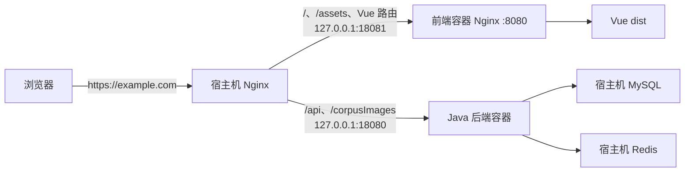

# 宿主机 Nginx 路由配置逐段解析

本文解释 [`docker/nginx/picture-zip-upload.conf.example`](../../docker/nginx/picture-zip-upload.conf.example)。它是一份应该人工合并到 Ubuntu 宿主机现有 Nginx 的配置片段，负责把公网请求分流给前端容器或 Java 后端。

它不是：

- 一份可以直接替换 `/etc/nginx/nginx.conf` 的完整配置。
- 前端容器里的 Nginx 配置。
- Docker Compose 文件。
- TLS 证书或域名配置模板。

前端容器内部的静态文件配置详见 [前端容器 Nginx 配置逐段解析](05-frontend-nginx-conf-explained.md)。

## 1. 它在整个部署链路中的位置



宿主机 Nginx 是外部请求的统一入口，通常继续使用公司现有配置完成：

- 监听 80/443。
- 管理域名。
- 加载 TLS 证书和私钥。
- 执行公司统一安全策略。
- 把不同 URL 路径转发给不同内部服务。

本模板只提供最后一项所需的 upstream 和 location 片段，不碰现有证书和 TLS 策略。

## 2. 为什么不能把整个文件直接放进任意目录

文件包含两种属于不同上下文的内容：

```text
http
├── upstream picture_zip_backend
├── upstream picture_zip_frontend
└── server（现有 HTTPS 虚拟主机）
    ├── location /api/picture-zip/
    ├── location /api/
    ├── location /corpusImages/
    └── location /
```

- `upstream` 块必须位于 `http` 上下文。
- `location` 块必须位于某个 `server` 上下文。

所以当前文件是“复制/合并提示”，不是天然可在单一位置 `include` 的完整文件。若把包含 `location` 的整个文件直接 include 到 `http`，Nginx 会报告类似：

```text
"location" directive is not allowed here
```

若把包含 `upstream` 的整个文件 include 到 `server`，也会因上下文错误而失败。

## 3. 正确合并后的结构示意

下面只展示层级，不应覆盖公司的真实配置：

```nginx
http {
    # 公司已有的 http 级配置

    upstream picture_zip_backend {
        server 127.0.0.1:18080;
        keepalive 16;
    }

    upstream picture_zip_frontend {
        server 127.0.0.1:18081;
        keepalive 16;
    }

    server {
        listen 443 ssl;
        server_name example.com;

        # 公司已有的证书和 TLS 配置继续保留

        location /api/picture-zip/ {
            # 复制模板中的对应指令
        }

        location /api/ {
            # 复制模板中的对应指令
        }

        location /corpusImages/ {
            # 复制模板中的对应指令
        }

        location / {
            # 复制模板中的对应指令
        }
    }
}
```

真实服务器可能通过多层 `include` 拆分文件。例如：

- upstream 放进 `http` 已包含的 upstream 目录。
- location 放进目标域名 `server` 已包含的 location 目录。

具体路径必须服从公司现有 Nginx 组织方式，不能看到 `.example` 后直接复制到 `/etc/nginx/conf.d/`。

## 4. 两个 `upstream` 是什么

`upstream` 给一个或多个上游服务器定义逻辑名称。后面的 `proxy_pass` 使用逻辑名称，不必重复写 IP 和端口。

### 4.1 后端 upstream

```nginx
upstream picture_zip_backend {
    server 127.0.0.1:18080;
    keepalive 16;
}
```

`picture_zip_backend` 是 Nginx 配置内部的名字，不是公网域名，也不是 Docker Compose 服务名。

当前只有一个后端地址：

```text
127.0.0.1:18080
```

生产 Compose 使用 host network，让 Spring Boot 默认监听宿主机回环地址 `127.0.0.1:18080`。因此：

- 宿主机 Nginx 可以访问它。
- 局域网或公网不能直接连接这个端口。
- 对外访问必须经过宿主机 Nginx。

### 4.2 前端 upstream

```nginx
upstream picture_zip_frontend {
    server 127.0.0.1:18081;
    keepalive 16;
}
```

前端容器内部监听 8080，建议通过 Docker 发布为：

```text
127.0.0.1:18081:8080
```

所以宿主机 Nginx 连接 `127.0.0.1:18081`，Docker 再把连接送到前端容器的 8080。

### 4.3 `keepalive 16`

```nginx
keepalive 16;
```

它为每个 Nginx worker process 最多缓存 16 条空闲上游连接，以便后续请求复用，减少重复 TCP 建连。

这里的 16：

- 是每个 worker 的空闲连接缓存上限。
- 不是整个 upstream 的总连接数上限。
- 不是最多只能同时处理 16 个请求。
- 不限制 worker 在忙碌时打开更多活动连接。

当前每个 upstream 只有一个 server，因此它主要提供连接复用，而不是负载均衡。以后加入多个 `server` 时，默认会使用加权 round-robin 分配请求。

### 4.4 当前模板的 keepalive 注意事项

Nginx 官方文档说明：使用 HTTP upstream keepalive 时，需要使用 HTTP/1.1（或支持的 HTTP/2），并清除发往上游的 `Connection` 头。对于 1.29.7 之前的 Nginx，这两个步骤尤其需要显式配置。

当前 location 已包含：

```nginx
proxy_http_version 1.1;
```

但没有包含：

```nginx
proxy_set_header Connection "";
```

而 1.29.7 之前 Nginx 反向代理的默认行为会设置 `Connection: close`。因此，如果生产宿主机 Nginx 版本早于 1.29.7，当前 `keepalive 16` 可能无法达到预期连接复用效果。

这不等同于请求一定失败：请求仍可建立新的 TCP 连接并正常代理，但 keepalive 优化可能没有真正生效。上线前应先确认：

```bash
nginx -v
```

若公司确认使用旧版本并希望启用 upstream keepalive，应由运维审查后在各代理 location 或合适的公共层级显式清除 `Connection` 头。本次说明文档不直接修改生产模板。

## 5. Nginx 怎样选择四个 `location`

这四个都是普通前缀 location，没有正则表达式。Nginx 会选择“匹配前缀最长”的一个。

```nginx
location /api/picture-zip/ { ... }
location /api/             { ... }
location /corpusImages/    { ... }
location /                 { ... }
```

| 请求 URI | 匹配结果 | 原因 |
| --- | --- | --- |
| `/api/picture-zip/tasks` | `/api/picture-zip/` | 它比 `/api/` 更长、更具体 |
| `/api/pictures/files/a.jpg` | `/api/` | 匹配通用 API 前缀 |
| `/corpusImages/a.jpg` | `/corpusImages/` | 匹配旧图片前缀 |
| `/assets/app.js` | `/` | 交给前端容器 |
| `/tasks/123` | `/` | 交给 Vue 前端路由 |
| `/apiSomething` | `/` | 不以 `/api/` 开头 |

配置顺序在这里不是决定因素；最长前缀优先。所以即使 `/api/` 写在 `/api/picture-zip/` 前面，更具体的上传路径仍会被选中。

以斜杠结尾的代理 location 对“不带末尾斜杠的相同前缀”有特殊处理。例如请求 `/api` 时，Nginx 通常会重定向到 `/api/`。客户端仍应按 API 约定使用完整、正确的路径。

## 6. 上传专用路由 `/api/picture-zip/`

```nginx
location /api/picture-zip/ {
    client_max_body_size 128m;
    proxy_request_buffering off;
    proxy_connect_timeout 10s;
    proxy_send_timeout 10m;
    proxy_read_timeout 10m;
    proxy_http_version 1.1;
    proxy_set_header Host $host;
    proxy_set_header X-Real-IP $remote_addr;
    proxy_set_header X-Forwarded-For $proxy_add_x_forwarded_for;
    proxy_set_header X-Forwarded-Proto $scheme;
    proxy_pass http://picture_zip_backend;
}
```

这条路由比通用 `/api/` 多了上传大小、缓冲和超时设置，专门照顾图片压缩包、分片上传和耗时导入请求。

### 6.1 最大请求体 128 MiB

```nginx
client_max_body_size 128m;
```

如果单个 HTTP 请求体超过 128 MiB，Nginx 会在请求到达 Java 后端前返回 413。

这里限制的是“单个请求体”，不是整个上传任务所有分片的总大小。例如每个分片 16 MiB、总文件 1 GiB，只要每个请求未超过限制，Nginx 这一层不会因为总文件大小直接拒绝。

它也不能单独决定最终上限；还要同时检查：

- Spring Boot multipart/request 限制。
- 应用接口自己的校验。
- 前端分片大小。
- 其他上游负载均衡器或 CDN 的限制。

### 6.2 关闭请求体缓冲

```nginx
proxy_request_buffering off;
```

默认情况下，Nginx 可能先完整读取客户端请求体，再发送给上游。关闭缓冲后，Nginx 会在接收数据的同时尽快转发给 Java 后端。

优点：

- 大文件不必先完整落到 Nginx 临时文件。
- 降低宿主机临时磁盘 I/O 和额外等待。
- 后端可以更早开始接收上传数据。

代价：

- 一旦 Nginx 已把请求体发送给某个上游，通常无法安全地把同一请求重试到另一个上游。
- 慢客户端会让后端连接保持更久。
- 后端需要能够承受客户端上传速度和连接时长。

配置同时显式使用 `proxy_http_version 1.1`。这对客户端使用 chunked transfer encoding 时避免因代理协议版本而重新缓冲也很重要。

### 6.3 三个超时分别控制什么

```nginx
proxy_connect_timeout 10s;
proxy_send_timeout 10m;
proxy_read_timeout 10m;
```

| 指令 | 控制阶段 | 当前值 |
| --- | --- | --- |
| `proxy_connect_timeout` | Nginx 与后端建立 TCP 连接 | 10 秒 |
| `proxy_send_timeout` | Nginx 向后端连续两次写操作之间的等待 | 10 分钟 |
| `proxy_read_timeout` | Nginx 从后端连续两次读操作之间的等待 | 10 分钟 |

两个 10 分钟超时不是“整个请求最多只能运行 10 分钟”。官方定义针对相邻两次读/写操作之间的空闲时间。只要持续有数据传输，完整请求可能超过 10 分钟。

连接超时只有 10 秒，是因为后端位于同一台宿主机的回环地址；如果 10 秒还无法建立本地连接，通常意味着后端未监听、资源异常或网络栈存在问题，不应让用户长时间等待。

## 7. 通用 API 路由 `/api/`

```nginx
location /api/ {
    proxy_http_version 1.1;
    ...
    proxy_pass http://picture_zip_backend;
}
```

它负责所有没有被更具体 `/api/picture-zip/` 捕获的 API，例如新图片访问路径 `/api/pictures/files/**`。

它没有单独设置：

- `client_max_body_size 128m`
- 上传请求缓冲关闭
- 10 分钟超时

因此它继承现有 `server` 或 `http` 层配置，若上层没有覆盖，则使用 Nginx 默认值。大文件上传接口应保持在专用 `/api/picture-zip/` 前缀中，或由运维明确评估其他路径是否也需要相同参数。

## 8. 旧图片路由 `/corpusImages/`

```nginx
location /corpusImages/ {
    proxy_http_version 1.1;
    ...
    proxy_pass http://picture_zip_backend;
}
```

项目保留 `/corpusImages/**` 作为历史图片 URL 前缀。宿主机 Nginx 没有直接读取 `/data/corpusImages`，而是把请求交给 Java 后端。

Java 后端通过静态资源映射读取容器中的：

```text
/data/corpusImages
```

生产 Compose 又把宿主机真实历史图片目录只读挂载到这个容器路径。因此完整链路是：


这种设计保留了应用层的现有静态资源映射。如果未来决定让宿主机 Nginx 直接用 `alias` 提供历史图片，那是另一套架构，需要重新评估权限、URL 编码、缓存、安全和应用行为，不能只把 `proxy_pass` 随手改成目录路径。

## 9. 前端兜底路由 `/`

```nginx
location / {
    proxy_http_version 1.1;
    ...
    proxy_pass http://picture_zip_frontend;
}
```

`/` 能匹配所有 URI，但只有在没有更具体 location 时才使用。因此下面请求会转到前端容器：

- `/`
- `/assets/app-123.js`
- `/favicon.ico`
- `/tasks/123`

前端容器 Nginx 再根据文件是否存在决定返回静态文件还是 `index.html`。

这形成两层职责：

```text
宿主机 Nginx：这个 URI 应该去前端还是后端？
前端容器 Nginx：这个前端 URI 对应真实文件还是 Vue 路由？
```

## 10. 四个代理请求头

每个 location 都重复设置：

```nginx
proxy_set_header Host $host;
proxy_set_header X-Real-IP $remote_addr;
proxy_set_header X-Forwarded-For $proxy_add_x_forwarded_for;
proxy_set_header X-Forwarded-Proto $scheme;
```

### 10.1 `Host`

```nginx
proxy_set_header Host $host;
```

把用户访问的主机名传给上游，而不是默认传递 upstream 名字。后端可据此生成链接、记录域名或执行 host 相关判断。

`$host` 在客户端 Host 头缺失或不合法时还有 Nginx server name 作为后备，通常比直接使用 `$http_host` 更稳妥。

### 10.2 `X-Real-IP`

```nginx
proxy_set_header X-Real-IP $remote_addr;
```

把当前直接连接到宿主机 Nginx 的客户端 IP 传给上游。

如果宿主机 Nginx 前面还有公司负载均衡器、CDN 或 WAF，那么 `$remote_addr` 可能是那一层代理的 IP。要恢复真实用户 IP，需要结合可信代理范围配置 Nginx real IP 模块，不能无条件相信任意客户端自带的转发头。

### 10.3 `X-Forwarded-For`

```nginx
proxy_set_header X-Forwarded-For $proxy_add_x_forwarded_for;
```

`$proxy_add_x_forwarded_for` 会在已有 `X-Forwarded-For` 链后追加当前 `$remote_addr`。它用于记录请求经过的代理链。

应用读取此头之前仍应配置可信代理边界，否则公网客户端可以伪造头部最左侧内容。

### 10.4 `X-Forwarded-Proto`

```nginx
proxy_set_header X-Forwarded-Proto $scheme;
```

把用户访问宿主机 Nginx 时使用的协议传给上游，通常是 `https`。上游内部连接虽然是普通 HTTP，但应用仍可知道外部原始协议是 HTTPS，避免生成错误的 `http://` 链接或重定向。

## 11. `proxy_pass` 为什么没有末尾 URI

```nginx
proxy_pass http://picture_zip_backend;
proxy_pass http://picture_zip_frontend;
```

这里的 `proxy_pass` 只有 scheme 和 upstream 名，没有附加 `/` 或其他 URI。Nginx 会把原始请求 URI 保留给上游。

示例：

```text
客户端请求 /api/picture-zip/tasks/123
后端收到   /api/picture-zip/tasks/123

客户端请求 /corpusImages/a.jpg
后端收到   /corpusImages/a.jpg
```

如果改成带 URI 的形式，例如：

```nginx
proxy_pass http://picture_zip_backend/;
```

Nginx 会按照 location 与 `proxy_pass` URI 的规则替换路径前缀，结果可能与后端 Controller/静态资源映射不一致。新手修改时必须特别关注 `proxy_pass` 后面有没有斜杠。

## 12. 三类请求的完整示例

### 12.1 打开 Vue 子页面

```text
GET https://example.com/tasks/123
```

1. 宿主机 Nginx 匹配 `location /`。
2. 原 URI `/tasks/123` 转发到 `127.0.0.1:18081`。
3. 前端容器 Nginx 找不到真实文件。
4. 前端容器返回 `index.html`。
5. Vue Router 渲染 `/tasks/123` 页面。

### 12.2 上传图片压缩包

```text
POST https://example.com/api/picture-zip/...
```

1. 宿主机 Nginx 选择更具体的 `/api/picture-zip/`。
2. 检查单请求是否超过 128 MiB。
3. 边接收边把请求体转发给 Java 后端。
4. 使用上传专用超时等待后端处理。
5. 前端容器 Nginx 完全不参与该请求。

### 12.3 读取历史图片

```text
GET https://example.com/corpusImages/medical/a.jpg
```

1. 宿主机 Nginx 匹配 `/corpusImages/`。
2. 保留完整 URI 转发到 Java 后端。
3. Java 静态资源映射读取只读挂载目录中的文件。
4. 响应沿原链路返回浏览器。

## 13. 修改和上线的安全流程

### 13.1 先确认内部服务

```bash
curl --fail http://127.0.0.1:18080/actuator/health
curl --fail http://127.0.0.1:18081/healthz
```

如果内部服务本身不可达，先解决容器、端口或应用问题，不要靠 reload Nginx 碰运气。

### 13.2 备份现有配置

在公司现有备份/配置管理流程中保存当前可工作的 Nginx 配置。不要只依靠终端历史或编辑器撤销。

### 13.3 合并后检查完整配置

```bash
sudo nginx -t
```

`nginx -t` 能检查语法、上下文、证书文件等引用，但不能证明 upstream 服务健康或完整业务请求成功。

需要排查 include 层级时可以使用：

```bash
sudo nginx -T
```

`nginx -T` 会打印完整展开后的配置。输出可能包含内部域名、路径或其他敏感配置，不要直接粘贴到公开聊天和工单。

### 13.4 只在检查成功后 reload

```bash
sudo systemctl reload nginx
```

reload 让 Nginx 平滑加载新配置，不应使用粗暴 kill 代替。reload 后仍要查看日志并执行请求验证。

### 13.5 验证和回滚

至少验证：

- 首页和静态资源。
- Vue 子路由刷新。
- 普通 API。
- 图片上传关键链路。
- 新旧图片 URL。
- 请求日志中的客户端 IP 和协议头。

如果出现问题，把目标域名的路由恢复到备份配置，再执行 `nginx -t` 和 reload。不要在故障现场同时修改证书、容器网络、数据库和多组 location。

## 14. 常见状态码和排查方向

| 现象 | 常见方向 |
| --- | --- |
| `413 Request Entity Too Large` | 请求超过当前 location 或上层代理的 body size |
| `502 Bad Gateway` | upstream 端口未监听、进程退出、连接被拒绝 |
| `504 Gateway Timeout` | 上游在超时窗口内没有继续响应 |
| API 返回 Vue HTML | `/api` 路径不正确，或请求绕过/未命中宿主机 API location |
| 前端页面 502 | `127.0.0.1:18081` 未发布或前端容器未启动 |
| 历史图片 404 | Java 静态映射、数据库 URL、只读挂载路径或文件本身有问题 |
| 上传中途失败 | 客户端网络、缓冲策略、上游超时、后端异常或存储空间 |

排查顺序建议：

1. 看浏览器/客户端请求的真实 URI 和状态码。
2. 看宿主机 Nginx access/error log。
3. 直接 curl 对应的 `127.0.0.1:18080/18081`。
4. 看后端或前端容器日志。
5. 再检查应用、数据目录和数据库。

## 15. 当前模板没有处理的事项

模板有意复用公司现有宿主机 Nginx，因此没有定义：

- `listen 443 ssl`。
- `server_name`。
- TLS 证书和私钥。
- HTTP → HTTPS 跳转。
- HSTS、CSP 等安全响应头。
- 限流和访问控制。
- CDN/WAF/负载均衡器真实 IP 信任配置。
- 宿主机日志格式和轮转。
- 多后端实例的负载均衡和健康检查。
- WebSocket/SSE 专用代理头和缓冲策略。

这些内容应继续服从公司已有配置。尤其不要为了使用模板而覆盖现有 HTTPS virtual host。

## 16. 官方指令参考

- [Nginx HTTP core module](https://nginx.org/en/docs/http/ngx_http_core_module.html)：`location`、`client_max_body_size` 和内置变量。
- [Nginx proxy module](https://nginx.org/en/docs/http/ngx_http_proxy_module.html)：`proxy_pass`、缓冲、超时、HTTP 版本和请求头。
- [Nginx upstream module](https://nginx.org/en/docs/http/ngx_http_upstream_module.html)：`upstream`、`server` 和 `keepalive`。
