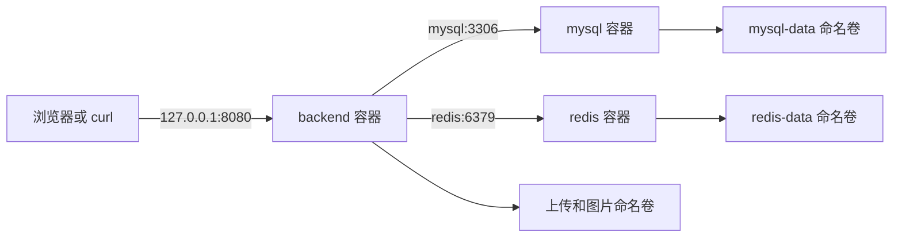
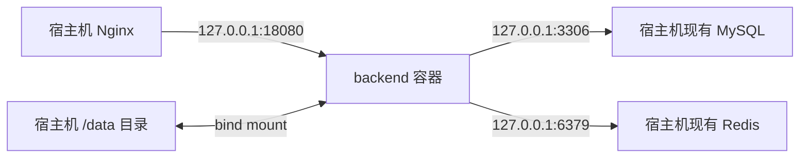
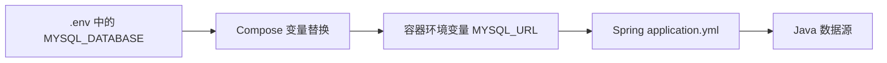

# Docker 配置学习指南

这组文档用于解释本项目中的 Docker 配置，而不是替代生产部署手册。阅读完成后，你应该能够回答下面几个问题：

- `Dockerfile` 如何把 Spring Boot 源码变成一个可运行镜像？
- 为什么 Compose 要拆成三个文件，而不是全部写在一个文件里？
- 本地的 MySQL、Redis 和图片数据保存在哪里？
- 为什么生产 Compose 不启动 MySQL 和 Redis？
- `.env` 中的变量最后是怎样进入 Java 应用的？
- 哪些命令只停止容器，哪些命令可能删除本地数据？
- 前端 Vue 源码怎样经过 Node.js 构建，并由非 root Nginx 提供静态文件？
- 前端容器 Nginx 与宿主机 Nginx 分别处理什么，它们怎样按 URL 协作？

真正执行本地启动、生产切换、备份和回滚时，仍应以根目录的 [Docker 与 Docker Compose 部署指南](../../DOCKER_DEPLOYMENT_GUIDE.md) 为准。

## 1. 推荐阅读顺序

1. 阅读本文，先建立镜像、容器、服务和数据卷的整体概念。
2. 阅读 [Dockerfile 逐段解析](01-dockerfile-explained.md)，理解后端镜像的产生过程。
3. 阅读 [Compose 配置逐段解析](02-compose-explained.md)，理解三个 Compose 文件如何合并。
4. 阅读 [数据持久化与常用命令](03-data-and-commands.md)，理解日常操作会怎样影响容器和数据。
5. 需要对接独立 Vue 项目时，阅读 [前端 Dockerfile 样例逐段解析](04-frontend-dockerfile-example-explained.md)。
6. 阅读 [前端容器 Nginx 配置逐段解析](05-frontend-nginx-conf-explained.md)，理解静态文件、缓存、健康检查和 Vue Router fallback。
7. 阅读 [宿主机 Nginx 路由配置逐段解析](06-host-nginx-routing-explained.md)，理解 HTTPS 入口、upstream、location、上传代理和请求头。

如果只是想启动后端项目，可以直接看第 4 篇；遇到不理解的配置，再返回前两篇查对应章节。第 5、6 篇面向独立前端仓库，第 7 篇面向生产服务器 Nginx 对接。

## 2. 先认识四个核心概念

### 2.1 镜像（image）

镜像可以理解为一个只读的软件安装包。它包含运行程序需要的文件、Java 运行时和默认配置，但不代表程序已经在运行。

本项目的 `Dockerfile` 最终生成后端镜像，例如：

```text
picture-zip-upload:local
```

其中 `picture-zip-upload` 是镜像名，`local` 是标签。标签通常用于区分本地版本、测试版本或正式发布版本。

### 2.2 容器（container）

容器是镜像的一次运行实例。镜像和容器的关系类似“Java 类”和“由这个类创建的对象”：

- 同一个镜像可以启动多个容器。
- 删除容器不会自动删除镜像。
- 重新创建容器时，容器自身可写层中的临时内容会丢失。

因此数据库和业务图片不能只放在容器自身的可写层中，需要使用数据卷或目录挂载。

### 2.3 Compose 服务（service）

Compose 用 YAML 文件描述一组需要协同运行的容器。`services` 下的 `backend`、`mysql`、`redis` 都是服务名。

服务名不一定等于最终容器名。日常命令通常使用服务名：

```bash
docker compose ... logs backend
docker compose ... restart backend
```

### 2.4 挂载（mount）

挂载让容器使用容器外部的数据。本项目使用两类挂载：

- 命名卷（named volume）：由 Docker 管理实际存储位置，本地环境使用。
- 绑定挂载（bind mount）：把明确的宿主机目录映射进容器，生产环境使用。

无论容器怎样重建，只要外部卷或宿主机目录还在，数据就还在。

## 3. 本项目的整体结构

本项目有两套不同的运行拓扑。

### 3.1 本地环境

本地使用 `compose.yaml + compose.local.yaml`，同时启动后端、MySQL 和 Redis：



三个容器加入同一个 Compose 网络。后端通过服务名 `mysql` 和 `redis` 找到另外两个容器，不需要知道它们的容器 IP。

### 3.2 生产环境

生产使用 `compose.yaml + compose.prod.yaml`，只启动后端容器：



这是一个重要的安全边界：

- 生产 Compose 不创建 MySQL 容器。
- 生产 Compose 不创建 Redis 容器。
- 生产 Compose 不迁移现有数据库数据。
- 生产图片目录直接挂载进后端容器。

因此，不要因为本地环境中存在 `mysql` 和 `redis` 服务，就误以为生产环境也会启动它们。

## 4. 为什么有三个 Compose 文件

三个文件并不是三套完全独立的配置，而是“公共配置 + 环境差异”：

| 文件 | 职责 | 是否单独使用 |
| --- | --- | --- |
| `compose.yaml` | 后端和维护任务共用的镜像、安全、日志、构建配置 | 否 |
| `compose.local.yaml` | 本地 MySQL、Redis、端口、网络和命名卷 | 与公共文件组合 |
| `compose.prod.yaml` | 生产宿主机网络、真实目录和资源限制 | 与公共文件组合 |

本地命令中的两个 `-f` 表示按顺序加载并合并文件：

```bash
docker compose --env-file .env \
  -f compose.yaml -f compose.local.yaml \
  up -d --build
```

可以把合并过程理解为：

```text
公共 backend 配置 + 本地 backend 配置 = 本地最终 backend 配置
公共 backend 配置 + 生产 backend 配置 = 生产最终 backend 配置
```

后面的文件负责补充或覆盖前面的文件。这样，安全选项、日志轮转等公共内容只需维护一次。

## 5. 一条配置从 `.env` 到 Java 应用的路径

以数据库地址为例，配置要经过下面几层：



本地 `.env` 中配置的是数据库名：

```dotenv
MYSQL_DATABASE=ai_dataset
```

`compose.local.yaml` 用它拼出容器环境变量：

```yaml
MYSQL_URL: jdbc:mysql://mysql:3306/${MYSQL_DATABASE:-ai_dataset}...
```

`application.yml` 再读取 `MYSQL_URL`：

```yaml
spring:
  datasource:
    url: ${MYSQL_URL:jdbc:mysql://localhost:3306/ai_dataset...}
```

这里存在两次不同的变量处理：

1. Compose 在创建容器前处理 `${MYSQL_DATABASE:-ai_dataset}`。
2. Spring Boot 在应用启动时处理 `${MYSQL_URL:默认值}`。

理解这两层后，排查“变量明明改了但没有生效”会容易很多。

## 6. 配置文件与职责索引

| 文件 | 主要读者 | 主要作用 |
| --- | --- | --- |
| `Dockerfile` | 开发和镜像构建人员 | 定义怎样构建后端镜像 |
| `.dockerignore` | 镜像构建人员 | 排除不需要发送给 Docker 的文件 |
| `compose.yaml` | 所有使用 Compose 的人员 | 定义公共服务配置 |
| `compose.local.yaml` | 本地开发人员 | 定义完整的本地依赖环境 |
| `compose.prod.yaml` | 生产运维人员 | 定义后端如何接入宿主机现有资源 |
| `.env.example` | 本地开发人员 | 本地变量模板 |
| `.env.prod.example` | 生产运维人员 | 生产变量结构示例，不含真实凭据 |
| `docker/frontend/Dockerfile.example` | 前端开发人员 | 应复制到独立 Vue 仓库的多阶段构建模板 |
| `docker/frontend/nginx.conf.example` | 前端开发人员 | 与前端镜像配套的非 root 静态文件 Nginx 配置模板 |
| `docker/nginx/picture-zip-upload.conf.example` | 运维人员 | 应拆分合并到宿主机 Nginx 的 upstream/location 路由片段 |
| `DOCKER_DEPLOYMENT_GUIDE.md` | 生产运维人员 | 备份、部署、检查和回滚步骤 |

## 7. 学习时的安全原则

- 可以随时执行 `docker compose ... config`，它只渲染配置，不会启动容器。
- 可以使用本地 Compose 练习，不要把公司生产密码复制到本地 `.env`。
- `docker compose down` 默认保留命名卷；`down -v` 会删除当前 Compose 项目的命名卷。
- 不要把宿主机现有 MySQL 数据目录直接挂进本项目的本地 MySQL 容器。
- 生产环境的真实变量文件应放在 Git 工作区之外。
- 修改配置后先看渲染结果，再启动容器。
